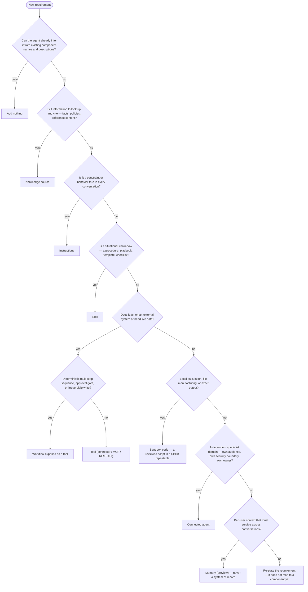

# Microsoft Copilot Studio New Experience — Expert Architecture Guide

As of 2026-08-19 — the platform evolves rapidly; re-verify status and limits against current Microsoft documentation before production decisions.

## Provenance legend

Every load-bearing claim in this guide carries a provenance tag:

- **[OFFICIAL]** — documented Microsoft behavior, sourced from Microsoft Learn, the Microsoft 365 message center (MC…), or official Microsoft blogs; linked where possible.
- **[CAT]** — guidance and field experience from Microsoft's Copilot Studio Customer Advisory Team (Power CAT): deep-dive decks, official FAQ answers, samples, and published case studies.
- **[INFERRED]** — this guide's own inference from documented behavior; consistent with the sources but not itself documented.
- **[STATUS UNVERIFIED]** — could not be confirmed in the reviewed sources as of 2026-08-19; verify against current documentation before relying on it.
- **[COMMUNITY/third-party]** — non-Microsoft community measurement or corroboration; directional input only, never load-bearing on its own. In-body wordings such as "third-party — treat as directional" and "community-observed, not official" belong to this category.

Tags occasionally appear in combined or qualified forms; a combined tag (e.g. [CAT/third-party]) inherits the confidence of its weakest member, and the qualifier "via search synthesis — verify" marks an official figure obtained indirectly through search summaries rather than from a fetched source page — verify it against the linked page before relying on it.

Two writing conventions run throughout. Statements prefixed **"Official behavior:"** describe what the platform documentedly does; statements prefixed **"Recommendation:"** are this guide's advice, to be weighed against your own constraints. Where status labels conflict (for example, GA announcements versus "(preview)" page titles), the conflict is flagged inline — treat GA/preview status per feature, not per experience.

## Table of contents

1. [New Copilot Studio mental model](#1-new-copilot-studio-mental-model)
2. [New vs Classic architecture](#2-new-vs-classic-architecture)
3. [Enhanced orchestration](#3-enhanced-orchestration)
4. [Instructions](#4-instructions)
5. [Knowledge](#5-knowledge)
6. [Skills](#6-skills)
7. [Tools](#7-tools)
8. [Workflows](#8-workflows)
9. [Memory](#9-memory)
10. [Microsoft IQ](#10-microsoft-iq)
11. [Connected Agents](#11-connected-agents)
12. [Sandbox / code execution](#12-sandbox--code-execution)
13. [Model selection](#13-model-selection)
14. [Evaluation](#14-evaluation)
15. [Monitoring](#15-monitoring)
16. [Security and governance](#16-security-and-governance)
17. [Performance](#17-performance)
18. [Decision tree for component selection](#18-decision-tree-for-component-selection)
19. [Migration/refactoring strategy from Classic](#19-migrationrefactoring-strategy-from-classic)
20. [Common anti-patterns](#20-common-anti-patterns)
21. [Architecture examples](#21-architecture-examples)
22. [Checklist for starting a new project](#22-checklist-for-starting-a-new-project)
23. [Checklist for reviewing an existing project](#23-checklist-for-reviewing-an-existing-project)
24. [Current limitations / preview considerations](#24-current-limitations--preview-considerations)
25. [Links to the current official Microsoft documentation](#25-links-to-the-current-official-microsoft-documentation)

## 1. New Copilot Studio mental model

The new Copilot Studio experience is not an incremental UI refresh. It is a different authoring paradigm: you stop authoring *flows* and start authoring *behavior*. In the classic model, the maker's job was to enumerate every conversational path in advance — topics, triggers, branches, variables — and the runtime's job was to walk the graph you drew. In the new model, the maker's job is to describe what the agent is, what it must always do, and what capabilities it can draw on; the runtime's job is to plan a path through those capabilities at request time. Official behavior: "Instead of authoring explicit conversation topics, flows, and branching logic, you describe your agent in natural language," and an enhanced orchestration runtime interprets that description on every turn [OFFICIAL — [agents-experience overview](https://learn.microsoft.com/en-us/microsoft-copilot-studio/agents-experience/overview)].

**The harness concept.** The unit of runtime architecture is now the *harness* — the orchestration and execution layer an agent runs on. Copilot Studio is a multi-harness platform with three harnesses: **Copilot Chat** (extending Microsoft 365 Copilot), **Standard** (classic topic-based agents and agent flows), and **GitHub Copilot** — the harness behind the "new experience," the same orchestration stack that powers GitHub Copilot's agentic experiences [OFFICIAL — [Choose a harness](https://learn.microsoft.com/en-us/microsoft-copilot-studio/harnesses-overview)]. You choose the harness at agent creation and there is no conversion in either direction afterward [OFFICIAL — [switch experiences](https://learn.microsoft.com/en-us/microsoft-copilot-studio/agents-experience/switch-experiences)]. The GitHub Copilot harness reached general availability on 2026-08-03 (message center MC1446644) [OFFICIAL], though many agents-experience Learn pages still carry "(preview)" labels — treat GA/preview status per feature, not per experience (see §24).

**The component model.** A new-experience agent is lean instructions plus seven declarative component classes, configured in the Build tab's components panel: Model, Microsoft IQ (preview), Skills, Tools, Knowledge, Connected agents, and Memory (preview) [OFFICIAL — [Build an agent](https://learn.microsoft.com/en-us/microsoft-copilot-studio/agents-experience/build-overview)]. The organizing rule, from the Copilot Studio CAT team's Technical Deep Dive: "every behavior belongs in the smallest component that makes it reliable and inspectable. Instructions carry what's always true, Knowledge the searchable facts, Tools the system actions, Memory the persistent context, Skills the situational procedures, and connected agents the real specialist domains" [CAT, quoting the official Deep Dive deck]. This smallest-reliable-component principle is the load-bearing design rule of the whole guide: it decides where any given requirement lives, and misplacing behavior (procedures in instructions, facts in prompt text, guarantees in prose) is the root cause of most degraded agents.

**The request lifecycle.** At runtime the harness runs a plan-act-observe loop [OFFICIAL — agents-experience overview; CAT for the context mechanics]:

1. A **user request** arrives (Preview tab or a published channel).
2. **Orchestration/reasoning** begins. The agent's **instructions are always fully in context**; knowledge sources, tools, and skills are registered as metadata only — name plus description — until needed [CAT].
3. The orchestrator interprets the request against instructions, then pulls **relevant knowledge** (searched on demand; retrieved files can be opened whole in the sandbox), loads a **relevant skill** when a description matches the situation, and calls a **tool or workflow only when action or determinism is required** — a system write, an exact calculation, a compliance-critical sequence.
4. It **observes** each result, adjusts the plan, and iterates — possibly delegating to a connected agent or running sandbox code — until it can compose the **response**, optionally with generated files.

Contrast the classic chain: **User → Topic (trigger phrase match) → trigger → condition nodes → variables → branches → Power Fx expressions → actions → Power Automate flow → response.** Every hop in that chain was a maker-authored artifact; the runtime added nothing you didn't draw. In the new lifecycle only the components exist at design time — the *path between them* is synthesized per request.

**What "the maker decides" now means.** The division of labor has inverted. At design time the maker decides the *inventory and the contracts*: which components exist, what their names and descriptions promise, what the always-true instructions constrain, which actions are locked behind deterministic workflows, and what the evaluation suite asserts. At runtime the platform decides the *routing and sequencing*: which component fires, in what order, with what generated clarifying questions for missing inputs. Recommendation: architect accordingly — invest your control effort in component boundaries, descriptions, deterministic islands, and evals, not in trying to script the path, because the path is no longer yours to script. Two corollaries follow. First, instructions are probabilistic — executed by an LLM, adherence varies by model — so they are never a guarantee and never a security boundary; anything that must be certain belongs in code, workflows, or platform controls [CAT/OFFICIAL]. Second, because the orchestrator, not the maker, selects tools, authorization must live in the tools themselves (connections, DLP, workflow gates), not in prompt text [INFERRED, consistent with CAT samples].

## 2. New vs Classic architecture

**Three harnesses, one platform.** The Power Platform admin center manages capacity "across all Copilot Studio harnesses, including Copilot Chat, Standard, and GitHub Copilot" [OFFICIAL — admin docs, ms.date 2026-08-03]. Copilot Chat is the extensibility surface for Microsoft 365 Copilot and is out of scope for this guide. The architectural decision that matters for custom agents is Standard versus GitHub Copilot, and it is a one-way door made at creation time.

| Dimension | Classic (Standard harness) | New experience (GitHub Copilot harness) |
|---|---|---|
| **Routing** | Trigger-phrase NLU (classic orchestration) or LLM plan over topic/tool descriptions (generative orchestration, GA for en-US agents since March 2025) | Agentic plan-act-observe loop over component descriptions; default, no toggle [OFFICIAL] |
| **State** | Topic and global variables, set and read deterministically | Memory (per-user, cross-conversation, preview) plus ephemeral sandbox files; no variables [OFFICIAL/CAT] |
| **Logic** | Condition nodes, branch trees, Power Fx expressions | Natural-language instructions and on-demand skills; deterministic logic pushed into workflows or sandbox code |
| **Integration** | Connectors, HTTP nodes, agent flows (Power Automate-style) | Tools: connectors, MCP (GA, Streamable HTTP transport only), REST API tools (preview), workflow-as-tool, connected agents |
| **UX** | Authored message nodes, mature adaptive cards, exact wording at exact points | Model-composed responses and generated files; rich UI components "still being actively worked on" [CAT — official FAQ] |
| **Testing** | Test pane, topic checker, activity map | Preview tab with activity trace/reasoning view; Evaluate tab (Agent Evaluation GA 2026-03-31, pages still preview-labeled) |
| **Cost model** | Per-use Copilot Credits after publish; M365 Copilot license zero-rates eligible usage in M365 channels | Usage-based Copilot Credits for **all** usage, including maker design/preview/evaluate time; no M365 Copilot license offset [OFFICIAL] |

**What disappears.** The new model has no topics, no trigger phrases, no condition trees, no variables, and no Power Fx [OFFICIAL/CAT]. These are not renamed — they are structurally absent, and their responsibilities redistribute: routing moves to descriptions plus the orchestrator, situational logic to skills, state to Memory and tool payloads, deterministic branching to workflows. Official behavior: the migration path is a redesign, not a port; the experimental migration plugin *proposes* a new architecture, and CAT explicitly warns against "turning every topic into a Skill and every variable into memory… that's archaeology with YAML" [CAT].

**What classic still does better.** Be precise with stakeholders here, because these are real capabilities, not nostalgia:

- **Fixed, auditable flows.** A topic graph is a complete, inspectable enumeration of every path a conversation can take — reviewable by compliance before a single conversation runs. Learn's own guidance for voice agents says to choose deterministic control when the flow must be exact [OFFICIAL — [voice agent guidance](https://learn.microsoft.com/en-us/microsoft-copilot-studio/guidance/voice-agents-control-conversation)].
- **Exact question order and verbatim wording.** Message nodes fire scripted text at scripted points. In the new experience the orchestrator composes — and tends to rewrite — final output; CAT found instructions-only attempts to preserve exact wording "somewhat inconsistent" (see §3 on over-summarization) [CAT].
- **Adaptive cards maturity.** Classic has years of rich-card tooling; equivalent rich UI in the new experience is in progress [CAT — FAQ; STATUS UNVERIFIED what ships today].
- **Zero-rated M365 usage.** On the Standard harness, a Microsoft 365 Copilot-licensed user's usage in M365 channels is covered by the license for eligible feature types. GitHub Copilot harness agents are always billed, regardless of license [OFFICIAL — harness usage admin doc].
- **Predictable cost.** A scripted topic run consumes a knowable number of billed events; the agentic loop's iteration count varies per request [INFERRED from the billing model].

**The no-conversion rule and its consequences.** No agent converts between harnesses in either direction [OFFICIAL]. Architecturally this means: harness choice is the first decision of any engagement; a "later upgrade" is a rebuild-plus-re-evaluation project and must be costed as one; and coexistence is the normal state — both experiences run side by side, and a stable classic agent needs no migration ("If it does the job, don't rush into an upgrade" — official FAQ, via CAT).

**When to still choose classic today.** Recommendation: choose the Standard harness when (1) the conversation must follow a compliance-locked script — regulated disclosures, exact question sequences, validated data capture; (2) approved wording must survive verbatim end to end; (3) the solution depends on adaptive-card-heavy UX; (4) the audience is M365 Copilot-licensed and the zero-rating materially changes the business case; (5) per-conversation cost must be predictable and capped by design; or (6) an existing classic agent is stable and tested. Choose the GitHub Copilot harness when the work is reasoning-heavy, multi-step, multi-source, artifact-producing (file generation, data analysis, sandbox code), or genuinely multi-agent. For mixed requirements, note that determinism does not disappear in the new model — it relocates into workflows called as tools (see the deterministic-spine pattern, §3), which covers many "we need one exact sequence" objections without forcing the whole agent onto classic. One more planning fact: developer and trial environments move to usage-based billing on 2026-09-01, so even experimentation on the new harness needs credit governance from day zero [OFFICIAL].

## 3. Enhanced orchestration

The new-experience orchestrator is the third generation of Copilot Studio routing: classic NLU trigger-phrase matching, then generative orchestration on the Standard harness (GA for en-US agents since March 2025), now the agentic loop of the GitHub Copilot harness — the default for new-experience agents, with no toggle [OFFICIAL — agents-experience overview]. Microsoft credits the rebuilt orchestration with roughly 20% evaluation-performance gain and close to 50% lower net token consumption versus the prior stack [OFFICIAL announcement figure; vendor-reported, not independently verified].

**How the orchestrator plans.** On each turn the selected model — the "orchestration engine" — interprets the user message against the instructions and the registered component metadata, constructs a plan (which knowledge to search, which tool to call, which skill to load, which connected agent to delegate to, in what sequence, with what data flowing between steps), executes a step, observes the result, and adjusts [OFFICIAL — [orchestration behavior](https://learn.microsoft.com/en-us/microsoft-copilot-studio/advanced-generative-actions); CAT]. Slot-filling is generative: missing tool inputs produce orchestrator-generated questions derived from input descriptions, not authored Question nodes [OFFICIAL — [add tools](https://learn.microsoft.com/en-us/microsoft-copilot-studio/add-tools-custom-agent)]. Multi-intent requests decompose into chained steps without any authored routing; delegation to connected agents passes relevant conversation history plus the user message, with the child's description deciding when routing happens [OFFICIAL — connected agents docs].

**Metadata-only registration.** The context-economics detail that drives everything else: knowledge sources, tools, and skills register in context as *metadata only* — name and description — with full content pulled on demand when the orchestrator selects them. Instructions are the sole exception, always fully loaded every turn [CAT/OFFICIAL]. Ten skills cost ten short descriptions per turn, not ten instruction sets. This is why the platform can scale to many capabilities (hard cap 128 tools, 25–30 recommended for selection accuracy; more than 25 knowledge sources triggers an internal GPT model that filters sources by description before searching [OFFICIAL]) — and why the description is not documentation but a functional interface.

**Descriptions are the routing contract.** Official behavior: "the name and description must be accurate and specific, because the agent uses these fields to determine what to call" — and Learn explicitly advises using descriptions to state what *not* to do "if you see the agent calling them at the wrong time" [OFFICIAL — generative orchestration guidance]. Recommendation, per CAT: write names like "HR Leave Eligibility Triage," not "HR Help"; state when to use *and when not to use* the component; and apply the test "if two reasonable makers would disagree on when it applies, the description is not specific enough." Treat any description change as a behavioral change requiring regression evals — and treat descriptions you didn't author (community skills, MCP server tool descriptions fetched at runtime) as an injection surface to review before trusting [CAT].

**How to influence orchestration.** Three levers, in priority order:

1. **Precise component descriptions** carry the routing for every unambiguous case. Fix these before writing any instruction hint [OFFICIAL — [instructions guidance](https://learn.microsoft.com/en-us/microsoft-copilot-studio/guidance/generative-mode-guidance)].
2. **Instructions that reference components by exact name**, reserved for genuinely ambiguous or conditional routing. Instructions steer planning, not just wording: "When the question involves monthly KPIs, use the MCP tool for data and then consult the knowledge base for corrections; if corrections exist, include them" makes the orchestrator conditionally chain two sources it would not otherwise combine [CAT]. Deep-dive on instruction authoring is §4.
3. **Input-variable descriptions act as instructions.** The orchestrator reads a tool input's description to decide what data to pass, so the description doubles as a directive — powerful enough that CAT uses it to have the orchestrator hand a full best-effort conversation transcript to a tool [CAT]. Write input descriptions as carefully as tool descriptions, and note the governance edge: this same mechanism can move sensitive conversation content into any tool the agent reaches.

**How to observe it.** In the Preview tab, every step of the loop is recorded in the activity trace, and the reasoning view is "your main debugging surface" — you watch which skill loaded, which knowledge was searched, which tool fired and with what payload [OFFICIAL — [activity trace](https://learn.microsoft.com/en-us/microsoft-copilot-studio/agents-experience/authoring-activity-trace); CAT]. Post-hoc, Dataverse `ConversationTranscript` records include the orchestration plan trace and knowledge-search detail (write latency, retention, and coverage caveats: see the two-plane telemetry model in §15). With a deep reasoning model the chain of thought appears in the transcript — the *why*; without it you see only the resulting plan. The assembled system prompt is deliberately never exposed, so plan-level traces are the ceiling of auditability [CAT/OFFICIAL].

**Failure modes and remedies.** Three recur:

- **False activation** — a component fires when it shouldn't. Cause: a description too broad, or overlapping with a sibling. Remedy: narrow the description, add explicit "do not use for…" language, and check for overlapping component scopes [OFFICIAL/CAT].
- **Missed activation** — the right component never fires. Cause: a vague or too-narrow description, or the orchestrator not knowing two sources should be combined. Remedy: sharpen the description; add a conditional instruction referencing the component by name — CAT's KPI agent returned uncorrected MCP data even though corrections sat in knowledge, until an instruction mandated the cross-check. Also prune stale knowledge sources: empty searches silently push the planner into expensive fallbacks and timeouts [CAT].
- **Over-summarization** — the orchestrator's final composition pass rewrites output that had to be verbatim (policy text, legal wording, exact figures). Instructions-only fixes were "somewhat inconsistent" in CAT testing; the reliable remedy is a deterministic output path that denies the orchestrator a rewrite pass — in the new experience, a workflow tool or sandbox-scripted output; on the Standard harness, a topic ending in a direct send [CAT].

Diagnose all three from the trace first, then fix the description, then the instructions — in that order. Changing descriptions or instructions is a behavioral change; re-run evals after each.

**The replacement test.** Classic makers encoded every decision as explicit routing logic. The new-experience equivalent is one question asked at design time: *can orchestration make this decision itself?* If a well-named, well-described component makes the choice inferable, write nothing — descriptions carry it. If the choice is ambiguous but always-true, add one instruction line naming the components. If it applies only in specific scenarios, put the procedure in a skill. Only when the decision must be *guaranteed* — an approval sequence, an irreversible write, exact math — does it leave the orchestrator entirely, into a workflow (100-second synchronous limit, 13 credits/100 actions) or sandbox code. That last step is the deterministic-spine pattern: deterministic workflows as the guardrail and execution layer, the orchestrator handling the ambiguous surround. Every condition tree you are tempted to rebuild should pass through this test first; most of it dissolves into descriptions, and what remains is the part that genuinely needed to be deterministic all along [CAT/OFFICIAL synthesis].

## 4. Instructions

### What it is

Instructions are the agent's always-on behavioral contract: natural-language guidance, edited on the Build tab, that defines who the agent is and how it must behave in every conversation. In the new experience they — not topics, triggers, or flows — are the primary mechanism for controlling agent behavior; the orchestrator interprets them to decide when to use knowledge and when to invoke other capabilities [OFFICIAL — [Configure agent details and instructions](https://learn.microsoft.com/en-us/microsoft-copilot-studio/agents-experience/authoring-instructions)]. If you create the agent by describing it in natural language, Copilot Studio generates a first draft of the instructions; treat that draft as input to review, not output to ship [OFFICIAL/CAT].

### How the runtime uses it

Official behavior: in the plan-act-observe loop (see §3), instructions are the one component that is always loaded in full, every turn. Knowledge, tools, and skills register as metadata only — name plus description — until the orchestrator pulls their full content on demand [CAT, describing product behavior]. Two consequences follow directly. First, instructions steer planning, not just wording: "instructions act as guidelines that the orchestrator follows not only to provide context for the answer but also to plan its actions" — for example, "when the question involves monthly KPIs, use the MCP tool for data, then consult the knowledge base for corrections and merge" [CAT]. Second, every instruction token is billed and re-processed on every turn under usage-based Copilot Credits, which meter all new-harness activity including maker design, preview, and evaluation time [OFFICIAL billing; INFERRED cost consequence].

Official behavior: instructions are probabilistic. They are executed by an LLM, adherence varies by model, and accumulating rules can degrade adherence to existing ones [CAT — instructions-only approaches were the least consistent method in CAT's own testing]. Instructions are therefore NOT a security boundary: anything that must never happen has to be enforced by platform controls — DLP, tool scoping, authentication, environment governance — not prompt text [INFERRED, supported by third-party injection research].

### Use it when

The content is true in every conversation, for every scenario. The canonical slots: identity and mission; scope and refusal boundaries (what the agent handles, declines, or redirects); tone and response behavior (format, length, citation policy); safety boundaries and escalation triggers; grounding rules (which source is authoritative, when to cross-check, what to do when retrieval returns nothing); source restrictions ("answer only from the attached knowledge"); cross-cutting tool-use rules ("validate X before calling tool Y"); and decision principles for ambiguity. Multi-source plans that must hold globally belong here too — the MCP-plus-corrections pattern above is the reference example [CAT/OFFICIAL].

The decision rule, in order [CAT]:

1. **Can the agent infer it** from well-written tool and knowledge descriptions? Then write nothing — descriptions are the routing surface, and duplicating them adds tokens without value.
2. **Is it always true?** Then it belongs in instructions.
3. **Is it situational?** Then it belongs in a skill (§6), loaded on demand.

### Do NOT use it when

Situational procedures belong in skills; data and reference facts belong in knowledge (§5) — instructions say how to use knowledge, never contain it; actions belong in tools (§7). Per the official component model quoted in §3, "every behavior belongs in the smallest component that makes it reliable and inspectable" [CAT, quoting the official Deep Dive deck]. And when output must be guaranteed — verbatim policy text, exact calculations, compliance formatting — use deterministic components (scripts in skills, workflows), because "if you need a 100% guarantee, use the code" [CAT].

### What it replaces from classic

Instructions replace topic authoring as the primary behavior surface: "instead of authoring explicit conversation topics, flows, and branching logic, you describe your agent in natural language" [OFFICIAL — [Choose a harness](https://learn.microsoft.com/en-us/microsoft-copilot-studio/agents-experience/classic-vs-new)]. There is no conversion between harnesses in either direction [OFFICIAL]. Classic deterministic interception patterns (`OnGeneratedResponse` post-processing, Power Fx) have no direct equivalent; their role passes to tools, skill scripts, and workflows [CAT/INFERRED]. There are no topics, no Power Fx, and no variables in the new model [OFFICIAL/CAT].

### Limits & status

Instructions ship with the GA harness (GA 2026-08-03, MC1446644) [OFFICIAL]. No documented character limit was found for the new experience [STATUS UNVERIFIED]; classic carried a widely reported 8,000-character field limit. Microsoft's standing guidance is that overlong instructions cause latency, timeouts, and prompt-handling issues [OFFICIAL]; unofficial community measurement puts the sweet spot near 1,000–1,500 characters [third-party — treat as directional].

### Design discipline

Recommendation: write lean, structured, positively framed instructions — headings per concern, bullets for parallel rules, numbered lists only where order matters, prohibitions reserved for true red lines. Name components exactly as configured, and fix component descriptions before adding instruction hints. Re-run evaluations after every instruction change, because new rules can silently weaken old ones [CAT/OFFICIAL]. Anti-patterns: the instruction blob ("one instruction blob with 43 tools and a prayer" [CAT]); pasting policy text into instructions; situational procedures inline; negative-only rule piles; migration archaeology (porting every classic topic into instructions); and treating instructions as an enforcement mechanism.

## 5. Knowledge

### What it is

Knowledge is the grounding layer: retrieval sources the orchestrator queries so answers come from organizational content with citations rather than model training. It is configured at the agent level from the Build tab [OFFICIAL — [Knowledge overview](https://learn.microsoft.com/en-us/microsoft-copilot-studio/agents-experience/knowledge-copilot-studio)]. The main source types and their characteristics [OFFICIAL unless noted]:

| Source | Retrieval model | Key characteristics |
|---|---|---|
| Uploaded files | Indexed in Dataverse | 512 MB/file, 500 files/agent; file collections group related documents; **no RBAC** — every user sees answers from all uploads |
| Public websites | Bing index, live | Must be Bing-indexed and public; 2-level crawl depth from the URL; ownership attestation at publish |
| SharePoint (Work IQ) | M365 tenant semantic index | Per-user permission trimming; 200 MB files with an M365 Copilot license in the tenant, files over 7 MB skipped without |
| SharePoint lists | Live query (preview) | Real-time data, no sync; attachments not indexed |
| Dataverse tables | NL-to-structured-query at runtime | Up to 15 tables per source; glossary/synonyms drive query quality; requires end-user auth; top-N results |
| Real-time enterprise connectors (Salesforce, ServiceNow, Zendesk, Azure SQL, D365) | Live "real-time RAG" (preview) | Only metadata indexed, no data movement; governed by connector DLP |
| Custom knowledge | `OnKnowledgeRequested` topic (shared runtime) | Integrates any search endpoint into the grounded-answer flow; 15 snippets max across all knowledge topics [CAT] |

Microsoft IQ/Foundry IQ (centrally tuned agentic retrieval, preview) is covered in its own section; Azure AI Search and Copilot connectors round out the catalog [OFFICIAL].

### How the runtime uses it

Official behavior: the orchestrator decides whether and which sources to search based on the question, the sources' names and descriptions, and the instructions; description quality "has a substantial impact" on selection. The pipeline is query rewriting with conversation context, retrieval, then synthesis into a cited answer that follows the instructions [OFFICIAL/CAT]. With more than 25 knowledge sources, an internal GPT model pre-filters candidate sources by description before searching — an extra hop that can misroute [OFFICIAL — [generative orchestration guidance](https://learn.microsoft.com/en-us/microsoft-copilot-studio/guidance/generative-orchestration)]. Citations appear per response, and the activity trace shows which sources were consulted per message; citation granularity is model-dependent [OFFICIAL/CAT]. A distinctive new-harness behavior: files retrieved from knowledge land in the agent sandbox, so the agent can open the whole file and analyze it with Python rather than being limited to retrieval snippets [CAT].

The caveat that shapes architecture: retrieval returns **top-N relevance-ranked matches, never exhaustive sets**. "Show me all 47 facilities in the North district" returns five to ten, and the user cannot tell the list is incomplete [CAT].

### Use it when

The question shape is fuzzy, conversational Q&A over documents or records, where a synthesized, cited, top-N answer is the goal — policies, manuals, KB articles, general Dataverse lookups for authenticated users. Apply the test: **can the agent reason directly over the source?** If the content is a bounded file the sandbox can load whole (a CSV, a contract), knowledge plus sandbox analysis covers even row-exact work. If the content is a large live system the agent only ever sees through query results, you are depending on retrieval quality — and the exhaustiveness caveat applies in full [CAT/INFERRED].

### Do NOT use it when

Do not rely on knowledge when results must be exhaustive or the query must be controlled — use deterministic retrieval tools instead: Dataverse List Rows for complete result sets, `searchQuery`/relevance search for fuzzy discovery at scale (including anonymous agents, under maker credentials), a Prompt tool for semantic reasoning over ≤1,000 prefiltered rows [CAT]. Do not use knowledge for aggregation ("how many…"), for verbatim unsummarized text (the summarization step cannot be removed), or as the system of record for compliance-critical lookups [CAT/INFERRED]. Production agents typically combine two or three retrieval methods; "start simple, hit the wall, add another method" [CAT].

### What it replaces from classic

Agent-level knowledge plus orchestrator planning replaces per-topic Generative Answers wiring and node-level source scoping. Note that classic "search only selected sources" was prioritization, not isolation — and the same holds now: any attached source can be consulted for any query, so the only hard isolation boundary is a separate agent [OFFICIAL Q&A/INFERRED]. Dynamic knowledge URLs (variable-parameterized website/SharePoint sources) replace per-region source sprawl and post-deploy URL rewriting [CAT].

### Limits & status

Core sources (files, websites, SharePoint, Dataverse) are long-standing; SharePoint lists, real-time enterprise connectors, Work IQ, and Foundry IQ are preview [OFFICIAL]. Many agents-experience knowledge pages still carry "(preview)" labels post-GA; treat status per feature. Numbers to design against: 512 MB/500 files uploads; 2-level website depth; 200 MB vs 7 MB SharePoint split; 15 Dataverse tables; 25-source GPT-filter threshold; SharePoint lists degrade beyond ~35,000 rows [OFFICIAL].

### Design discipline

Recommendation: design grounding conservatively. Scope website sources to paths, never domain roots; name and describe sources by business function; invest in Dataverse glossaries — cryptic column names with empty glossaries defeat NL2Query [CAT]. The RBAC caveat is a hard selection criterion: access-restricted documents go to SharePoint (permission-trimmed per user), never to file upload (flat access for all users) [CAT/OFFICIAL]. Disable general knowledge and web search where grounding-only behavior or Bing egress policy demands it — web-search traffic falls under the Microsoft Privacy Statement, not the DPA [OFFICIAL]. Debug retrieval with the activity trace before touching instructions.

## 6. Skills

### What it is

A skill is situational procedural know-how packaged for on-demand loading: a name, a description, and Markdown instructions, following the **Agent Skills open format** (SKILL.md plus optional `scripts/`, `references/`, and `assets/` folders — agentskills.io, originated by Anthropic, adopted by Microsoft across Copilot Studio, VS Code, and GitHub Copilot) [OFFICIAL — [Skills overview](https://learn.microsoft.com/en-us/microsoft-copilot-studio/agents-experience/skills-overview)]. Copilot Studio supports the full package shape: create from blank in studio, or upload a standalone SKILL.md or a .zip with SKILL.md at top level [OFFICIAL].

### How the runtime uses it

Official behavior: progressive disclosure. Only the skill's name and description sit in context by default; the full SKILL.md loads when the orchestrator judges the task matches; bundled references and scripts are read only when the loaded skill directs the agent to them. Ten skills cost ten short descriptions per turn, not ten instruction sets [CAT, describing product behavior]. You never call a skill directly — the runtime activates it from the description, which makes the **description routing metadata, not documentation**. A skill that fires too often has too broad a description; one that never fires is too narrow or misses the users' vocabulary; the reasoning view is the debugging surface [OFFICIAL/CAT]. An activated skill guides rather than compels: the model retains judgment over whether to follow it exactly [CAT].

Skills can also **soft-point at tools** ("use the order-lookup action here"). The pointer grants nothing — if the tool is absent, the step silently fails; if the tool's description is rewritten, the handoff can break [CAT]. Bundled scripts execute in the agent sandbox: Python 3.12.9 with ~99 preinstalled libraries [CAT observed, 2026-07], no `pip install`, no network egress, ephemeral per conversation. External reach happens only through configured knowledge and tools, which stay under tenant governance [CAT/OFFICIAL].

### Use it when

The content is a situational procedure the model cannot infer — step three of the decision rule in §4. CAT's taxonomy names nine shapes a skill can take: a **reference manual** (proprietary schema or data model), a **specialist** (region-specific tax rules), a **playbook** (support triage), an **SOP** (refund policy windows), a **briefing pack**, a **checklist** (pre-submission validation), a **protocol** (security-incident handling), a **runbook** (pipeline with failure handling), and a **template** (fixed output format or house style) [CAT]. Also use a skill to make discovered behavior repeatable: package a reviewed script so the agent executes instead of re-deriving — CAT's redlining skill cut a ~15-minute agentic reasoning marathon to ~15 seconds, roughly 60x (the codify-the-loop method, §12) [CAT].

The three-way boundary decisions:

- **Skill vs instructions:** always-true goes in instructions; scenario-specific goes in a skill, out of default context.
- **Skill vs tool:** external reach and live data are tools; method, sequence, validation, and format are skills; often both, with the skill soft-pointing at the tool.
- **Skill vs new agent:** same audience, same knowledge and security boundary — a skill. Different audience, different security boundary, or an agent already overloaded with tools and context — a separate connected agent. "Three agents" are often one agent with three skills [CAT].

### Do NOT use it when

Not for always-true behavior, plain facts, external actions, or the obvious (a well-described tool needs no manual). Not for steps that must never vary — a skill guides, the model decides; exact steps go in a bundled script or a workflow (§8) [CAT/INFERRED]. Do not design skill scripts around packages the sandbox lacks, network calls, or files persisting between conversations — all three are impossible by design [CAT].

### What it replaces from classic

Skills absorb the procedural share of what classic topics did, without trigger-phrase routing or dialog trees, and they dissolve the instruction blob by moving situational guidance out of always-on context [CAT/INFERRED]. They fully replace classic Bot Framework/Azure Bot Service "skills" in name only — that legacy feature required hosted bots, app registrations, and deployment; an Agent Skill is a Markdown file [OFFICIAL]. Do not migrate by converting every topic into a skill — "that's archaeology with YAML" [CAT].

### Limits & status

Skills shipped with the new experience and exist only on the GitHub Copilot harness; exact GA labeling is unverified — several Learn pages moved off "(preview)" while localized versions lag [STATUS UNVERIFIED]. Scope was per-agent (traveling with the agent through Power Platform solutions); as of August 2026, What's New describes creating a skill once and adding it to multiple agents, with a skill catalog referenced — mechanics not fully verifiable [OFFICIAL wording; details STATUS UNVERIFIED]. Names: lowercase letters, numbers, hyphens. Open-format limits: name ≤ 64 characters, description ≤ 1024 [OFFICIAL for the spec; Copilot Studio enforcement INFERRED]. Known behavior: skills can activate for an initial request and silently drop out for follow-ups unless the description explicitly claims follow-up ownership [CAT].

### Design discipline

Recommendation: write descriptions that state when to use and when not to ("Use for leave eligibility and required documentation. Do not use for payroll."). If two reasonable makers would disagree on when a skill applies, the description is not specific enough [CAT]. Keep SKILL.md lean (~under 500 lines) and push depth into `references/`. Treat every skill you did not write as **untrusted code**: review for prompt injection, tool-misuse instructions, and behavior that does not match the claimed purpose before adding — sandbox containment means a malicious script cannot exfiltrate directly, so its attack path is persuading the agent to misuse an existing tool, which makes least-privilege tool configuration the blast-radius control [CAT]. Never put secrets or environment-specific values in skill files; skills are solution components — version, review, and promote them through ALM like code, and gate uploads with human review, because a SKILL.md zip with Python is a code deployment wearing a content costume [CAT/INFERRED].

## 7. Tools

### What it is

Tools are the action layer: external capabilities the orchestrator can invoke, selected from conversation context and the tool's description with no per-tool topic wiring [OFFICIAL — [Tools overview](https://learn.microsoft.com/en-us/microsoft-copilot-studio/agents-experience/tools-overview)]. The types:

| Type | What it is | Status |
|---|---|---|
| Connector tools | Individual actions from prebuilt Power Platform connectors; maker controls description, inputs, defaults | GA substrate |
| Custom connectors | Power Platform wrapper for your own API; per-action governance; OBO/SSO capable | GA substrate |
| REST API tools | Tools generated from an OpenAPI v2 spec (v3 auto-converted) | Preview [OFFICIAL] |
| MCP servers | Streamable-HTTP MCP endpoint; tools discovered dynamically at runtime; tools and resources supported | GA; SSE transport unsupported since Aug 2025 [OFFICIAL] |
| Prompts | Fixed-contract single-turn model tasks (classification, extraction), optionally with code interpreter | Long-standing classic surface; code interpreter for prompts GA (Sept 2025) [OFFICIAL]; prompts-as-tools GA labeling [STATUS UNVERIFIED] |
| Workflows as tools | Deterministic multi-step automations (§8) | See §8 status |
| Computer use | Vision-driven UI automation for systems with no API | GA ~May 2026 [OFFICIAL] |

### How the runtime uses it

Official behavior: the planner selects and parameterizes tools from names and descriptions; slot-filling is generative (the orchestrator asks its own questions for missing inputs, driven by input descriptions). The **description is therefore the orchestration contract** — accurate, specific, stating what the tool is for and what it is NOT for [OFFICIAL guidance]. Connector-tool inputs can be AI-filled, hardcoded, or defaulted, and descriptions are maker-editable ("instructions without instructions"). MCP tool descriptions and schemas are fixed by the server owner and not maker-editable; individual MCP tools can only be toggled off by disabling "Allow all" [CAT/OFFICIAL]. Every tool output enters the model's context: oversized payloads degrade reasoning or fail on token limits, so return summaries and IDs, not dumps — MCP-native designs write large outputs as resources and pass resource IDs between tools [CAT].

### Use it when

The agent needs a system action or live data. Selection guide [CAT decision framework]: built-in connector when you need description/input control and per-action governance; built-in MCP server when the capability is MCP-only or you want an auto-updating, chainable tool bundle; custom connector for thin wrappers of internal APIs without hosting; custom MCP server for thick logic (aggregation, RAG, own LLM calls) serving agents across platforms with code-first ALM; REST API tool for the quickest path from a spec (preview — prefer a custom connector for governed reuse); prompts for fixed single-turn model tasks; computer use strictly as a last resort where no API exists.

### Do NOT use it when

Static reference content is knowledge; repeatable procedure is a skill; specialist domains are connected agents [CAT]. Do not use computer use where an API or connector exists — cost, latency, fragility [CAT/INFERRED]. Do not block a conversation on any tool that can exceed the synchronous window (§8). Do not duplicate the same operation as both a connector tool and an MCP tool without disambiguated descriptions — the orchestrator has no basis to choose [CAT].

### What it replaces from classic

Description-driven selection replaces trigger phrases, topic flows, and action nodes per capability; the steering surface you gain in exchange is descriptions, input configuration, and instructions [OFFICIAL/CAT]. Chained topic logic moves into thick tools, MCP servers, or workflows: "complex orchestration logic belongs in the server or connector, not in agent topics" [CAT].

### Limits & status

Hard cap **128 tools per agent; 25–30 recommended** for selection quality [OFFICIAL — [Add tools](https://learn.microsoft.com/en-us/microsoft-copilot-studio/add-tools-custom-agent)]. MCP: GA, Streamable HTTP only; the MCP wizard generates a custom connector plus connection reference under the hood, so Power Platform ALM applies — and the connector must be moved to its own solution before cross-environment deployment [OFFICIAL/CAT]. Swagger-level edits to MCP connectors require removing and re-adding the tool in every consuming agent [CAT — verify currency]. REST API tools remain preview [OFFICIAL].

### Design discipline

**Authentication.** Two credential modes: **end-user credentials** (the agent acts as the signed-in user; results respect the user's permissions; first-run consent card for Entra connectors, one Allow click) and **maker-provided credentials** (every user runs as the maker) [OFFICIAL]. Recommendation: default to end-user credentials for anything user-facing; for custom APIs and MCP servers, configure **OBO/SSO on the custom connector** (app registration for the API, connector app registration with Azure API Connections as authorized client) so tokens stay inside the connector framework — avoid manual OAuth for Entra B2E scenarios, which exposes `System.User.AccessToken` and supports only one resource [CAT/OFFICIAL]. Reserve maker credentials for genuinely shared, non-privileged service actions, and expect admins to be able to block maker-provided credentials environment-wide (2026 release wave 1 plan item — verify current rollout state) [OFFICIAL — release plan].

**Governance granularity — the big asymmetry.** Admins can block individual connector actions via DLP/Advanced Connector Policies. For MCP, platform-enforced per-tool control does not exist: allowing a server allows its full, dynamically discovered tool surface, and server-side changes flow into your agents automatically — a supply-chain consideration. Mitigate by blocking whole servers in DLP, pinning tool lists (disable "Allow all"), and treating server owners as trusted publishers [CAT/OFFICIAL].

**Irreversible actions.** Instructions cannot guarantee the agent asks before acting (§4), and a per-tool "require approval before run" setting was not confirmed in reviewed sources [STATUS UNVERIFIED]. Recommendation [INFERRED]: design write-capable tools idempotent where possible (accept an external key, upsert semantics); route genuinely irreversible operations — payments, deletions, external communications — through a workflow with an explicit deterministic confirmation or approval step rather than exposing the raw action to the planner; and align tool credentials with the end user so the permission system, not the prompt, bounds the damage.

**Tool-count discipline.** Budget 25–30. Past that, consolidate related operations behind a thick MCP server or workflow, or split into connected specialist agents. Validate selection behavior with the activity trace and evaluations after every description change — a description edit is a behavioral change [OFFICIAL/CAT].

## 8. Workflows

### What it is

Workflows are the new experience's deterministic automation primitive: rule-based, visually designed processes where the same input always produces the same output. They run manually, on a schedule, on external events, or when an agent calls them [OFFICIAL — [Workflows overview](https://learn.microsoft.com/en-us/microsoft-copilot-studio/workflows-experience/flows-overview)]. The redesigned designer adds native AI actions, agent handoffs, NL-first authoring, node-level testing (run one node in place; AI prompt nodes preview without consuming credits), inline error surfacing with a publish gate, and run history [OFFICIAL]. Workflows are the evolution of classic agent flows and share their machinery: triggers, "Respond to the agent", solution/Dataverse storage, and Copilot Credits billing at **13 credits per 100 actions** [OFFICIAL].

The division of labor is the platform's own framing: **the agent reasons, the workflow executes.** Agents bring interpretation and goal-driven choice; workflows bring structure, auditability, and cost predictability — a deterministic workflow bills a flat action meter and runs the same path every time, where agentic reasoning over the same steps costs more and varies per run [OFFICIAL guidance; INFERRED cost point].

### How the runtime uses it

A workflow surfaces to the agent as a tool. Official behavior — the workflow-as-tool contract [OFFICIAL — [Add a workflow as a tool](https://learn.microsoft.com/en-us/microsoft-copilot-studio/agents-experience/tools-add-workflow)]: the workflow must have the **"When an agent calls the flow" trigger** and a **"Respond to the agent" action**, respond in real time (asynchronous response off), be published, and answer within the **100-second** limit. The orchestrator selects it by name and description like any tool; per input you choose AI-filled or custom value, and you configure what the agent does on completion. Inputs and outputs natively support **Text, Boolean, and Number** only; complex types need conversion; at most **1 MB** returns to the agent per action [OFFICIAL]. File inputs are supported from version 2025.7.2, via the custom-value Power Fx path [CAT — documented on the classic surface; carry-over to new-experience tool configuration INFERRED].

The inverse also exists: an **agent node inside a workflow**. The workflow pauses at one step, hands context to an agent for interpretation (classify, extract, judge), receives structured output, and continues — "the flow stays fully in charge" [OFFICIAL/CAT]. This inverted control is the pattern for injecting exactly one AI-dependent step into an otherwise rule-based, auditable process.

### Use it when

The process is a repeated, deterministic, multi-step procedure: approvals, transactional sequences, multi-system updates, compliance-relevant operations. **Do not leave transactions to reasoning:** re-implementing stable rule-based processes as agent instructions sacrifices determinism, auditability, and cost predictability for nothing [OFFICIAL guidance/INFERRED]. For long-running work — human approvals, request-for-information, batch processing — use the **async continuation pattern** [CAT]: split at "Respond to the agent" (quick acknowledgment inside 100 seconds), run the long work after it (paused webhook-based waits dehydrate and cost nothing for days), then call the agent back with the **"Execute Agent"** action of the Copilot Studio connector, passing `System.Conversation.Id` in and back out so the callback correlates with the original conversation; write the instructions to handle both the initial call and the callback.

### Do NOT use it when

**Do not move reasoning into workflows:** logic that needs judgment on most steps becomes brittle rule-branches; keep interpretation in the agent (or one agent node) and "keep the automation deterministic everywhere it can be" [CAT/OFFICIAL]. Do not wrap a single connector call in a workflow — a plain tool is simpler [INFERRED]. Never run a human approval synchronously from live chat: multistage approvals by definition exceed 100 seconds and always time out [CAT].

### What it replaces from classic

In the agent context, workflows subsume classic agent flows and Power Automate cloud flows called from bots, and they inherit the deterministic role classic topic decision trees played [community framing; STATUS UNVERIFIED as verbatim official]. The trigger/response contract, 100-second wall, and type limits carry over from agent flows [OFFICIAL per item]. Converting a cloud flow to an agent flow is permanent, and new-experience artifacts cannot convert to classic [OFFICIAL].

### Limits & status

Status is genuinely conflicting: the workflows designer and workflow-as-tool show GA signals dated 2026-08-03 (message center MC1442234), yet the relevant Learn pages still carried "(preview)" titles at the time of writing — verify per-page banners before committing production designs [OFFICIAL, flagged as conflicting]. Express mode (preview) accelerates logic-heavy, data-light flows under ~100 actions [OFFICIAL]. Licensing: agent flows bill through Copilot Credits (13/100 actions) with no Power Automate license needed for the flow itself; the flow must run under the Copilot Studio plan to surface as a tool [OFFICIAL/CAT].

### Design discipline

Error handling and gotchas, from field experience [CAT]:

- **`FlowActionTimedOut`** — the 100-second wall. Optimize, adopt Express mode, or restructure with async continuation; do not retry your way past it.
- **`FlowActionBadRequest`** — almost always schema drift: the tool's cached input/output schema no longer matches the flow after a parameter change, or an unsupported type (Choice/option sets error). Refresh the tool after every parameter edit.
- **Connection references, the two-layer credential trap** — the tool-level "Maker-provided credentials" setting governs only the invocation; every action inside the flow authenticates via its own connection reference. Audit both layers, or the flow silently runs as a different identity than the tool setting suggests.
- **Invisible tools** — flows built outside a solution, missing the Copilot Studio plan, or left with the asynchronous-response toggle on never appear in the tool picker.
- **Payloads** — Base64 inflates files ~33% against the 1 MB return cap; store large outputs in Blob/SharePoint/Dataverse and return a link.
- **Webhook exposure** — the pause-and-resume `notificationUrl` is SAS-signed but unauthenticated; anyone holding it can resume the flow. Keep it server-side only.

Recommendation: treat every stable multi-step procedure the agent needs as a named workflow tool with typed inputs, a tight description, and deterministic error paths; keep everything ambiguous in the agent; and put the boundary between them under evaluation (§14) so regressions in either half surface before users find them.

## 9. Memory

**What it is.** Memory is the persistent-context component of the new experience: an agent-level toggle (Build tab, components panel) that lets an agent remember details from its interactions with a user and apply them in future conversations. Status: **preview** — the Learn page is titled "Memory (preview)" [OFFICIAL — [Memory overview](https://learn.microsoft.com/en-us/microsoft-copilot-studio/agents-experience/memory-overview)]. In the component model, memory's job is exactly one thing: *the persistent context* — never facts for everyone (knowledge, §5), never procedures (skills, §6), never state plumbing [CAT].

**How it works: capture, store, apply.** Official behavior: the agent *captures* signals such as user preferences and relevant context shared in conversation, *stores* them as files in a dedicated per-user folder in Microsoft-managed storage, and *applies* them in later interactions [OFFICIAL]. Two properties follow. First, memory is **per-user and per-agent**: every user gets an isolated store, and one user's context never reaches another. Second, application is **model-mediated, not a deterministic lookup** — the orchestrator decides whether a stored memory shapes a turn, so recall is probabilistic like everything else in the loop (§3) [OFFICIAL/INFERRED].

**Personalization use cases.** Memory earns its place when the agent serves repeat, authenticated 1:1 users whose context should carry across conversations: preferred output formats and tone, role and team, recurring report parameters, standing constraints ("I only manage the EMEA region"). The payoff is fewer repeated preliminaries and more consistent results over time — the documented design center of the feature [OFFICIAL].

**When it improves interpretation — and when it undesirably biases it.** Memory helps when the persisted context is stable and genuinely user-specific. It hurts when a remembered detail is stale, situational, or wrong: a preference captured once during an atypical task silently colors every later interpretation, and because application is invisible in the response, neither user nor maker easily notices *why* the agent is skewing. Recommendation [INFERRED]: enable memory only where personalization is a stated requirement, and expect *behavioral drift per user* — the same agent answers the same question differently for different users, which a fixed-persona evaluation suite cannot see.

**Privacy and governance model.** The defaults are strongly user-protective, which is precisely what makes memory unsuitable for anything record-like:

- **User-private and maker-blind.** Memories are visible only to the user; the maker and other users cannot read them [OFFICIAL]. You cannot debug, audit, or curate what an agent has remembered.
- **User-controlled.** Users can ask what the agent remembers, correct or delete memories in chat, and view/delete everything via a memory portal [OFFICIAL].
- **Auto-expiring.** After 28 days without interaction, that user's memories for that agent are deleted [OFFICIAL].
- **No files.** Memory persists facts and context only — not sandbox outputs or documents (§12) [CAT/OFFICIAL].
- **Off in shared surfaces.** Memory is disabled in group chats and Teams channels [OFFICIAL].
- A tenant-level admin kill-switch specific to Copilot Studio agent memory is [STATUS UNVERIFIED]; the documented PowerShell/Graph memory controls belong to M365 Copilot personalization and may not govern Studio agents.

Because users can silently delete memories and the platform expires them, **memory must never be the system of record** for consents, commitments, case data, or anything compliance-relevant — persist those through tools into Dataverse or the line-of-business system (§7) [INFERRED].

**The ON-vs-OFF evaluation discipline.** Recommendation [INFERRED, grounded in the evaluation constraints above]: treat enabling memory as a controlled experiment, not a checkbox. Establish the agent's eval baseline with memory off (that is what your test sets actually measure); then pilot with memory on for a defined user cohort against a memory-off control, comparing task success, escalations, and satisfaction over multiple weeks — long enough for stores to accumulate and for the 28-day expiry to matter. Re-run the comparison after significant instruction or model changes. **Never enable memory by default.** It changes agent behavior in ways you cannot inspect (maker-blind), cannot regression-test (per-user), and cannot fully roll back (stored context lingers until deleted or expired). And do not import classic habits: turning every classic variable into a memory during migration is the documented anti-pattern — "that's archaeology with YAML" [CAT].

## 10. Microsoft IQ

**What it is.** Microsoft IQ is a **context layer** that connects an agent to organizational data through specialized sources, configured separately from knowledge via its own button in the Build-tab components panel. Status: **preview** across the Copilot Studio surface [OFFICIAL — [Microsoft IQ overview](https://learn.microsoft.com/en-us/microsoft-copilot-studio/agents-experience/use-microsoft-iq)]. It has three source families [OFFICIAL — [enable](https://learn.microsoft.com/en-us/microsoft-copilot-studio/agents-experience/microsoft-iq-enable) / [manage](https://learn.microsoft.com/en-us/microsoft-copilot-studio/agents-experience/microsoft-iq-manage)]:

| Family | Connects the agent to | Notes |
|---|---|---|
| **Work IQ** | The organization's emails, chats, files, activity | Mail, Calendar, Teams, OneDrive toggle per agent; **User Profile and Microsoft 365 Copilot Search turn on by default** when Work IQ is enabled |
| **Fabric IQ** | Business data and analytics in Microsoft Fabric | Data-driven insights over the Fabric estate |
| **Foundry IQ** (preview) | Enterprise knowledge bases indexed by Azure AI Search / built in Azure AI Foundry | Explicitly preview within the preview |

A Work IQ-enabled agent can answer questions about the signed-in user's recent mail, meetings, and Teams conversations; look up people and org structure; search OneDrive/SharePoint files; run broad M365 Copilot search; and — where admins allow — take actions such as drafting emails [OFFICIAL].

**Organizational context versus explicit knowledge.** The architectural distinction that decides when to use IQ: knowledge sources (§5) are **content you explicitly add and curate** — files, SharePoint sites, websites, Dataverse tables; Microsoft IQ provides organizational data that **flows dynamically based on the signed-in user's context** [OFFICIAL]. You cannot pre-enumerate "the user's calendar" as a knowledge source; that is IQ's territory. Conversely, a curated policy library is knowledge, not IQ. A subtler advantage: Work IQ tooling handles schema discovery, query generation, retrieval, and response formatting internally, so it survives the schema drift that silently breaks hand-built connector tools [CAT].

**Permission trimming.** Official behavior: IQ grounding enforces existing Microsoft 365 permissions — the agent sees only what the signed-in user can see, and write actions are off unless an admin enables write operations in the M365 admin center [OFFICIAL, write-enable detail via search synthesis — verify]. This is genuine security trimming at the source, not instruction-level filtering — which matters, because instructions are not a security boundary (§4). It also means IQ answers are inherently per-user: two users asking the same question get differently grounded answers, with the same evaluation caveat as memory (§9).

**License and availability requirements.** Work IQ requires a **Microsoft 365 Copilot license per user** [OFFICIAL]. The Aug 2026 licensing guide is reported to include employee-facing usage under a licensed, authenticated identity in that USL — but this conflicts with the harness billing rule stated throughout this guide (§2, §16, §24) that GitHub Copilot harness usage is always credit-billed regardless of license [CONFLICTING SOURCES — verify against the current licensing guide and the harness-usage admin doc before costing]. Admin consent for the WorkIQAgent.Ask permission is reported as a prerequisite [OFFICIAL via secondary summary — verify]. Environment-level availability is admin-controlled [OFFICIAL]. Either way, budget in Copilot Credits: the reported rate card prices tenant-graph-grounded responses at roughly 12 credits versus roughly 2 for ordinary knowledge responses — a 6x per-response premium high-volume agents must budget for [OFFICIAL rates via search synthesis; verify against the current [billing page](https://learn.microsoft.com/en-us/microsoft-copilot-studio/agents-experience/billing-credit-overview)].

**When a dedicated enterprise source is more appropriate.** Recommendation — do not reach for IQ when:

1. **The agent is anonymous or external-facing.** No M365 identity means no user-context grounding and no license coverage [INFERRED].
2. **The content is static and curated.** Plain knowledge sources are cheaper per response and give you control over exactly what grounds the answer [INFERRED from official rates].
3. **You need retrieval precision.** Self-configured connector tools let you scope query patterns, columns, and row counts; "out-of-the-box tools get you started fast; configuring your own gives you precision" [CAT].
4. **The real requirement is reasoning over a governed data estate.** A Fabric data agent attached as a connected agent (§11) gives you an owned, separately governed specialist rather than an ambient context feed.

Recommendation: layer deliberately — curated knowledge for stable documents, Microsoft IQ for dynamic user-scoped work context, self-configured tools where precision matters — and enable only the Work IQ sources the scenario needs, remembering that User Profile and M365 Copilot Search come on by default [CAT/OFFICIAL].

## 11. Connected Agents

**The taxonomy.** Three constructs hide behind "multi-agent," and confusing them is the most common design error in this area:

- **Child agents** live *inside* a main agent and are fully owned by it — grouping tools, instructions, and knowledge around a single intent. In the new experience their role has shrunk: the official FAQ states "we have a cleaner model now with connected agents: less overlap, and most of the role that child agents played can be covered by skills" [CAT — official FAQ]. Recommendation: prefer a skill for situational procedure and a connected agent for a real domain; reach for a child agent only for internal modularization that neither covers.
- **Connected agents (Copilot Studio → Copilot Studio)** are fully independent, separately published agents that also run standalone and can be reused by multiple parents. When the primary agent's orchestrator judges that a request matches a connected agent's domain, it delegates; the connected agent runs **in its own orchestration context with its own instructions, knowledge, and tools** and returns its result [OFFICIAL — [Connected agents overview](https://learn.microsoft.com/en-us/microsoft-copilot-studio/agents-experience/authoring-add-other-agents)].
- **External agents** extend the mesh beyond Copilot Studio through four channels [OFFICIAL — [Add other agents](https://learn.microsoft.com/en-us/microsoft-copilot-studio/authoring-add-other-agents)]: **Microsoft Foundry** agents (Entra ID auth, project endpoint URL; new-Foundry-portal agents only — older-portal agents fail with "404 – Version not found"); **Fabric data agents** (reasoning over warehouses, lakehouses, semantic models; published with a rich description, same tenant, M365 Copilot license listed among requirements); **Microsoft 365 Agents SDK** agents over the Activity Protocol; and **any A2A-protocol agent** (JSON-RPC 2.0, endpoint or agent-card URL, riding the custom connector infrastructure — so on-premises and vNet agents are reachable) [OFFICIAL/CAT]. GA status is mixed: Microsoft's 2026 what's-new coverage reports Fabric, Agents SDK, and A2A connections reaching GA in the May–August 2026 wave, while individual Learn pages still carried "(preview)" titles at research time — verify per connection type before committing [OFFICIAL, conflicting labels flagged].

**Description-driven delegation.** There is no routing table. The parent delegates on each agent's *description*, exactly as it selects tools (§3, §7) — no trigger phrases, no custom logic [OFFICIAL]. Official behavior: "if descriptions are vague, identical, or inaccurate, the parent can't make good routing decisions." The instruction patterns that make multi-agent systems behave are documented on the [multi-agent patterns page](https://learn.microsoft.com/en-us/microsoft-copilot-studio/guidance/multi-agent-patterns) [OFFICIAL]: give the parent a **single voice** ("You're the only agent that communicates with the user. Combine findings from all child agents into a single response"), tell every subagent to return findings rather than reply to the user, and make orchestration explicit — invoke, wait, combine, respond. Treat each connected agent's description plus its input/output contract as a published interface; changing either is a breaking change for every parent [INFERRED].

**Constraints.** For MCS-to-MCS connections: the target must be in the **same environment**, **published**, **opted in** to allow connections from other agents, and its **name must be under 30 characters** or the connection fails [OFFICIAL]. Copilot Studio agents are tenant-scoped — no cross-tenant composition [OFFICIAL]. No documented cap on connected agents per parent was found [STATUS UNVERIFIED]; in practice the bound is routing quality, the same pressure behind the 128-tool cap and 25–30 recommendation [INFERRED].

**When to decompose.** Split into connected agents when one or more of these holds:

1. **Ownership** — different teams need to build, test, version, and publish independently; Learn lists separation of concerns and independent ownership as core benefits [OFFICIAL].
2. **Domain isolation** — the specialist is a genuinely different business domain with its own audience or security boundary, not a themed subset of the same one [CAT].
3. **Knowledge boundaries** — sources are genuinely different corpora that would cross-contaminate retrieval if pooled (recall that >25 knowledge sources triggers description-based filtering, §5) [OFFICIAL/INFERRED].
4. **Tool-count pressure** — the orchestrator "struggles to reliably differentiate which tool to call" as the surface approaches the 25–30 recommendation; splitting restores a small, coherent decision space per agent [CAT/OFFICIAL].
5. **Release cadence** — the specialist changes on a different rhythm and needs its own eval and publishing lifecycle [INFERRED from the ownership benefit].

**The counter-case.** Official behavior: "multi-agent orchestration can be powerful, but it's not always necessary," and "if you only have one knowledge source, use a single agent with knowledge instead of splitting into two subagents" [OFFICIAL]. A thin wrapper around one API call is a tool or MCP server, not an agent — agents earn delegation only when they must *reason* over their domain [CAT/INFERRED].

**Latency and billing cost of hops.** Every delegation is an extra orchestration hop, and the callee runs its **own full orchestration loop** — Learn states plainly that multi-agent splits "can increase latency due to the extra orchestration hops" [OFFICIAL]. Budget roughly one additional planning cycle per hop and keep delegation depth shallow — flat hub-and-spoke, not chains [INFERRED]. How a delegated turn is metered is not documented [STATUS UNVERIFIED]; the safe planning assumption is that both the parent's and the callee's orchestration consume Copilot Credits, since both loops actually run — validate with consumption analytics before scaling [INFERRED].

**Governance.** The admin **kill-switch** is Power Platform admin center → Copilot → Settings → **Connected Agents**, enabling or disabling connected-agent connectivity per environment (part of the preview channel-publishing and connected-agent access controls) [OFFICIAL — [configure access](https://learn.microsoft.com/en-us/power-platform/admin/security/configure-channel-connected-agent-publishing)]. Callee-side opt-in gives per-agent consent semantics — but treat any agent that allows connections as an internal API and review it at publish time [OFFICIAL/INFERRED]. The headline data risk: **conversation history crosses the agent boundary** — MCS delegation can pass conversation history, and the A2A payload includes the complete chat history plus locale and metadata [CAT]. For external endpoints, everything the user has said in session can leave your platform: review data residency, DLP coverage, and endpoint trust before connecting, and never ship the demo-grade "auth: none" A2A configuration [CAT/INFERRED].

## 12. Sandbox / code execution

**What it is.** Every new-harness agent gets a code-execution sandbox by default: "a container with a Python runtime, local files, preinstalled libraries, and shell tools, all managed by Copilot Studio" [CAT]. Observed contents (2026-07-21, point-in-time, not a contract): **Python 3.12.9** with **~99 preinstalled libraries** [CAT observed]. Unlike the classic code interpreter — an opt-in, toggle-scoped feature — the sandbox is *ambient*: part of the harness itself, used even by the knowledge-retrieval pipeline, which is why files retrieved from knowledge can be opened whole and analyzed with code rather than consumed as snippets (§5) [CAT; OFFICIAL — [harness comparison](https://learn.microsoft.com/en-us/microsoft-copilot-studio/harnesses-overview)]. Treat it as GA with the harness; no separate status flag exists [INFERRED, STATUS UNVERIFIED for per-feature flags].

**Why it exists: models predict, code computes.** An LLM should not perform arithmetic or emit large exact payloads (a valid .docx, a filled workbook, long JSON) directly, because it predicts tokens rather than computing results. What it is good at is writing the code that computes; the sandbox is where that code runs [CAT]. Concretely: prorated calculations and what-if analyses done "in code rather than in the model's head"; native generation of Word, Excel, PowerPoint, and PDF outputs — including genuine OOXML tracked changes for redlining; full-file analysis of every row of a CSV from knowledge [CAT/OFFICIAL]. Recommendation: route by executor — LLM for language and judgment, sandbox for computation and file assembly, tools for anything external, workflows (§8) for deterministic multi-step sequences.

**Generated code versus skill-packaged scripts.** Code reaches the sandbox by two paths, chosen by the model at runtime [CAT]. The agent can *generate* code — write Python, run it, read the traceback, revise, retry — ideal for novel one-off work but slow and run-to-run variable. Or it can execute a *reviewed script packaged in a skill* (§6) — fast, consistent, versionable through normal ALM. The bridge is the **codify-the-loop** method [CAT]: prototype with the agentic loop until it discovers working logic, then strip the hardcoding and freeze the generalized script into a skill. The canonical datapoint: a redlining task that took ~15 minutes of generate/fail/rewrite cycles dropped to ~15 seconds as a skill script — roughly 60x — and every avoided iteration is avoided credit spend, since sandbox loops bill like everything else on the harness [CAT].

**Constraints and their design consequences.** Three hard properties shape everything you build on the sandbox:

- **No network egress.** Code cannot call an API, send email, or write to SharePoint — `requests` is installed but nothing built with it can leave. All external reach goes through configured knowledge and tools, which stay inside DLP and governance controls [CAT/OFFICIAL]. Consequence: the sandbox is architecturally incapable of exfiltration — the core admin reassurance — and any output that must land somewhere must travel via a tool.
- **No pip install.** The preinstalled set is fixed ("what ships in the container is what you get") and may change over time. Consequence: inventory the environment before writing skill scripts (the harness-explorer pattern) and code against confirmed, stable libraries [CAT].
- **Ephemeral per conversation.** The sandbox is a working area, not storage; nothing persists after the conversation, and memory stores facts, not files (§9). Consequence: **design explicit file egress** — every conversation that produces a file must end by returning it to the user or persisting it through a tool (SharePoint, OneDrive, Dataverse connector) [CAT]. Never design the next conversation around finding a file in the sandbox.

The underlying isolation architecture (documented for the M365 code-interpreter family Learn cites as covering agents): a fresh isolated VM per execution, destroyed afterward with nothing persisted; quotas on time, CPU, memory, and disk; runtime code scanning that terminates suspicious sessions [OFFICIAL — [code-interpreter security](https://learn.microsoft.com/en-us/microsoft-365-copilot/extensibility/code-interpreter-security)]. One trust caveat: because skills bundle executable scripts, any skill you did not author must be reviewed like untrusted code before installation (§6) [CAT].

**When the sandbox beats an external service — and when it can't.** The sandbox wins when the work is stateless per conversation, needs no external calls, and operates on files already in the conversation or knowledge — in which case building a separate Azure Function per calculation is pure added surface area [CAT/INFERRED]. A tool, connector, MCP server, or external service is *required* when you need network access, secrets, persistent state, packages outside the container, long-running or scheduled jobs, or hard SLAs; deterministic high-volume pipelines where per-run variance is unacceptable belong in workflows or flows, not generated code [INFERRED/CAT].

**Computer use: the related UI-automation path.** Where no API exists at all, computer use agents (CUA) — a separate tool, not the sandbox — operate Windows applications and websites through the UI, vision-driven and goal-based. GA since ~May 2026 across commercial geographies [OFFICIAL — [computer use](https://learn.microsoft.com/en-us/microsoft-copilot-studio/computer-use)]. Three runtimes: the Microsoft-managed **hosted browser** (zero setup, not Entra-joined or Intune-managed — explicitly not for production); the **Cloud PC pool** (Entra-joined, Intune-enrolled, auto-scaling — the enterprise path, still preview); and **bring-your-own-machine** (enabling a machine for computer use breaks existing desktop-flow connections on it) [OFFICIAL/CAT]. Recommendation: prefer a stable API, connector, or deterministic RPA wherever one exists; reserve CUA for shifting or variable UIs where visual reasoning and self-correction are worth the latency, and govern it with session replay, human supervision, and Purview audit from day one [CAT/OFFICIAL].

## 13. Model selection

**The per-agent picker.** The model is a first-class component: Build tab → components panel → **Model** → select → Save. One model choice powers the whole harness loop — planning, tool selection, and response composition — replacing the classic experience's scatter of primary-model plus separate preview pickers for deep reasoning, generative responses, and prompt builder [OFFICIAL — [Select a model for an agent](https://learn.microsoft.com/en-us/microsoft-copilot-studio/agents-experience/authoring-select-agent-model)]. Official behavior: the choice affects **reasoning depth** (multi-step capability), **response quality** (nuance and accuracy), and **speed** (faster models may be less capable). Because the model *is* the orchestrator (§3), changing it changes routing behavior, not just prose style.

**The catalog — and its volatility.** Models observed selectable in-product across 2026 CAT posts: **GPT-4.1, GPT-5 Chat, GPT-5 Auto, GPT-5 Reasoning, and Claude (Sonnet and Opus)** — with Claude Sonnet 4.5 and 4.6 used in specific builds [CAT]. GPT-5 Auto uses a per-request router to pick between the high-throughput chat model and the deep-reasoning model; GPT-5 Reasoning pins the deep-reasoning model [OFFICIAL]. The catalog is **volatile by design**: newer models land in early-release-cycle environments first, preview and experimental models are gated behind the per-environment admin setting "Preview and experimental AI models," and the current default model is [STATUS UNVERIFIED]. Recommendation: verify the live model list in-product per environment; do not build documentation or contracts around a catalog snapshot.

**Reasoning depth versus latency versus cost.** The trade-off triangle is explicit, and on the new harness it is priced: Copilot Credits are charged for LLM tokens, tools, and the harness itself, so more reasoning means more tokens means more credits — including during maker design, preview, and evaluate time [OFFICIAL — [billing overview](https://learn.microsoft.com/en-us/microsoft-copilot-studio/agents-experience/billing-credit-overview)]. Pinning a deep-reasoning model on a high-volume, latency-sensitive FAQ agent buys latency and credit burn for little quality gain [INFERRED]; conversely, a chat-class model on a genuinely multi-step analytical agent produces shallow plans. GPT-5 Auto delegates the per-request choice to the router — a maintainability convenience at the cost of run-to-run variability [OFFICIAL/INFERRED].

**Anthropic models: a governance decision, not just a quality one.** Official behavior [OFFICIAL — [Anthropic in Microsoft services](https://learn.microsoft.com/en-us/microsoft-365/copilot/connect-to-ai-subprocessor)]: Anthropic models require **explicit tenant-admin opt-in** (M365 admin center, plus PPAC controls); they run on **Anthropic-hosted infrastructure (AWS), outside Microsoft-managed environments**; and Microsoft states its standard customer agreements and **DPA do not apply** to Anthropic's processing — Anthropic acts as a subprocessor with its own contractual safeguards. If an admin disables Anthropic models, agents built on them **automatically fall back to the default OpenAI model** — a silent behavioral change, so treat the admin toggle as part of your change-control surface [OFFICIAL/INFERRED]. Recommendation: obtain governance sign-off on extra-Microsoft processing before selecting a Claude model, and re-validate data-residency and EU-boundary commitments whenever the agent model crosses providers.

**Behavioral differences are real — match model to use-case, and evaluate.** Model choice has observable functional consequences: as of May 2026, GPT-5 Chat tended to return one citation per source file while Claude Sonnet 4.6 returned multiple citations when multiple chunks grounded the answer — "factor citation behaviour into your model selection"; Anthropic models expose reasoning traces consumable in custom UIs where GPT-family models in Copilot Studio did not [CAT]. Recommendation: choose by use-case complexity — chat-class models for routine conversational and retrieval work; reasoning-class models (GPT-5 Reasoning, Claude Opus-class) for multi-step analysis, complex tool chaining, and agentic file work where accuracy beats speed; Auto where the workload genuinely mixes both. **Do not default to the most powerful model** — it is the most expensive, slowest, and least necessary choice for most agents, and on usage-based billing that default compounds across every turn and every maker preview session. Finally, **a model change is a release**: citation behavior, summarization tendencies, and routing all shift by model, so re-run the agent's full evaluation suite on every model switch, exactly as for an instruction change (§14) [CAT].

## 14. Evaluation

The new experience removes the deterministic scaffolding — topics, trigger phrases, Power Fx conditions — that architects previously used to reason about agent behavior statically. What replaces it is a probabilistic plan-act-observe loop steered by instructions and routing metadata (see §17 for the runtime economics). The architectural consequence is blunt: **you cannot know what a new-experience agent does by reading its configuration; you can only know by measuring it.** Evaluation-first development is therefore not a QA nicety but the primary correctness mechanism. Recommendation: build the test set alongside the first draft of the instructions, and treat any un-evaluated change as an unreviewed change [CAT/INFERRED].

### The Evaluate tab

Official behavior: every agent in the new experience carries an [Evaluate tab](https://learn.microsoft.com/en-us/microsoft-copilot-studio/agents-experience/analytics-agent-evaluation-intro) where you define named evaluations — a test set plus a test method — and run them repeatedly [OFFICIAL]. Agent Evaluation is GA at platform level as of 2026-03-31 [OFFICIAL], but the agents-experience Evaluate pages still carry "(preview)" labels; treat sub-features added during 2026 (whole-test-set evaluation, grader feedback, version comparison, analytics-sourced test generation) as preview unless individually confirmed [OFFICIAL, conflicting labels flagged].

Documented mechanics [OFFICIAL — [test-set creation](https://learn.microsoft.com/en-us/microsoft-copilot-studio/analytics-agent-evaluation-create), [multi-turn](https://learn.microsoft.com/en-us/microsoft-copilot-studio/analytics-agent-evaluation-multi-turn), [methods](https://learn.microsoft.com/en-us/microsoft-copilot-studio/analytics-agent-evaluation-overview), [results](https://learn.microsoft.com/en-us/microsoft-copilot-studio/analytics-agent-evaluation-results)]:

| Facet | Documented behavior |
|---|---|
| Single-response test sets | Max 100 cases; authored, CSV-imported, or AI-generated from agent design/knowledge — and from real analytics conversations (2026 update) |
| Conversational test sets | Max 20 cases, 12 messages (6 Q/A pairs) each; auto-generated conversation sets with simulated user profiles |
| Test methods | General quality (default LLM judge), Exact match, Text similarity, Compare meaning, intent recognition, Custom graders (your criteria + labels) |
| Results | Per-case Pass / Fail / Invalid / Error, run-level pass rate, near-real-time streaming; version-vs-version comparison; activity-map link from failures |
| Retention | 89 days in-product; export CSV for longitudinal trends |

### What to test

A test set that only asks expected questions measures the happy path of a probabilistic system — the least informative slice. Recommendation: cover, at minimum: expected answers on core journeys; **unsupported questions** (the agent should decline, not improvise); ambiguous phrasings; follow-up turns (conversational sets exist precisely because context loss and instruction drift are multi-turn failures [OFFICIAL]); wrong or colloquial terminology for domain concepts; multilingual inputs where the audience warrants; questions whose answer is genuinely absent from knowledge (hallucination resistance — the correct output is "I don't know"); **skill activation** — fires when it should, stays silent when it shouldn't, and persists across follow-ups (skills can silently drop out mid-task [CAT]); **tool activation** including wrong-tool and missing-tool cases; knowledge-source selection when sources overlap; permission-sensitive queries (per-user trimming, §16); and the edge cases production has already produced — grow the set with every incident [CAT]. Use the Copilot Studio Kit's Plan validation to assert *which tools appeared in the plan*, not just whether the final answer read well [OFFICIAL — Kit docs].

### Regression triggers

Because knowledge, tools, and skills route on name + description metadata, **editing a description is a behavioral change**, not documentation hygiene [CAT/OFFICIAL]. Re-run the benchmark set on any change to: instructions (including reordering — a CAT trial showed expanding 7 instruction rules to 14 dropped pass rate from 60% to 20% [CAT]); knowledge sources (adding, removing, or re-describing — stale sources silently push the planner into expensive fallbacks [CAT]); skills; tools (a skill soft-pointing at a tool breaks if the tool's description is rewritten [CAT]); the orchestration model (model swaps and GPT-5 Auto routing changes are regressions-in-waiting); memory enablement; and orchestration configuration generally. Recommendation: keep the benchmark set version-controlled with the agent source, evaluate the draft before publish, and evaluate again in the target environment after deployment [CAT — ALM guidance].

### LLM-judge discipline

Do not gate releases on a single 1–5 score. CAT's guidance, which we endorse as policy: decompose judgments into **binary, evidence-backed checks**, combine them with a written rule versioned outside the model, gate on dealbreakers, and prefer pairwise version comparison over absolute scores [CAT]. Calibrate judges against human-labeled references and a second judge from a different model family; recalibrate on every judge-model change — grader drift is an ongoing maintenance load, which is why Microsoft itself ships thumbs-feedback on evaluation results [CAT/OFFICIAL]. Reserve LLM judges for genuinely fuzzy judgments; script deterministic checks (format, arithmetic, required fields) instead [CAT].

### CI/CD gates, the Evaluation API, and the Kit

Official behavior: an [Evaluation REST API](https://learn.microsoft.com/en-us/microsoft-copilot-studio/analytics-agent-evaluation-rest-api) on `api.powerplatform.com` lists test sets, triggers runs, and reads results — and can evaluate **draft** agents, which is what makes pre-merge gating possible [OFFICIAL/CAT]. The CAT EvalGateADO pattern: pack the solution from source on every PR, import into a dedicated CI environment, resolve the agent by schema name, run the eval against the draft, fail the pipeline below a pass-rate threshold, emit JUnit XML [CAT]. Two hard caveats: auth is **delegated only — no app-only path** [CAT; STATUS UNVERIFIED whether since lifted], so pipelines persist a real user's refresh token (Key Vault, minimally scoped account, tokens lapse after 90 idle days); and the CI environment executes unreviewed branch content, so it must hold no production data [CAT/INFERRED]. The [Copilot Studio Kit](https://learn.microsoft.com/en-us/microsoft-copilot-studio/guidance/kit-overview) complements rather than duplicates this: channel-realistic Direct Line testing of *published* agents, multi-turn scripts, plan validation, rubric refinement, and multi-agent admin runs [OFFICIAL — Kit docs]; the [connector actions](https://learn.microsoft.com/en-us/microsoft-copilot-studio/analytics-agent-evaluation-automate-tools) cover scheduled post-deploy runs [OFFICIAL].

### Cost and side effects

Official behavior: evaluation runs execute the real agent — tools and connectors actually fire — and consume Copilot Credits like runtime usage does [OFFICIAL-leaning; exact billing wording STATUS UNVERIFIED — verify against the [billing FAQ](https://learn.microsoft.com/en-us/microsoft-copilot-studio/faq-billing-licensing)]. Two consequences. First, an eval case that exercises "send the escalation email" **sends the email**: point side-effecting tools at test doubles or sandbox systems in CI environments [INFERRED]. Second, eval suites have a real credit bill — budget them like load tests. Recommendation: tier the suites — a small smoke set per PR, the full set nightly [INFERRED].

## 15. Monitoring

Evaluation tells you whether a change is safe to ship; **Monitor tells you what actually happened after you shipped it** — and, on this harness, while you were building it, since maker activity also bills and executes for real. The new experience makes this a first-class tab in the four-tab surface (Build, Preview, Evaluate, Monitor) [OFFICIAL].

### The Monitor tab and the trace surfaces

Official behavior: the Monitor tab is the post-publish operational view — task history, files accessed, and activity — per Microsoft's harness GA framing [OFFICIAL — MC1446644-era announcement]; finer-grained item lists circulating in training material are [STATUS UNVERIFIED] at that granularity. Monitor → Performance consolidates user-feedback analytics (reactions, comment drill-down), superseding the classic Analytics → Satisfaction page [OFFICIAL — Microsoft training content]. The [unified activity and transcript view](https://learn.microsoft.com/en-us/microsoft-copilot-studio/authoring-review-activity) (GA 2025-10) lets makers inspect and pin sessions; the activity map is "the call stack for a conversation turn" — the execution chain of connected agents, tools, and knowledge lookups, with per-step inputs and outputs [OFFICIAL].

In the new experience, every step of the agentic loop is recorded in an [activity trace](https://learn.microsoft.com/en-us/microsoft-copilot-studio/agents-experience/authoring-activity-trace), and the **reasoning view is the primary debugging surface** [OFFICIAL/CAT]: watch which skill loaded, which tool the plan selected, what a knowledge search returned. CAT's operating rule applies verbatim — a skill firing too often means the description is too broad; never firing means too narrow (§6) [CAT]. Chain-of-thought visibility with deep reasoning models, and the deliberately never-exposed system prompt, are as described in §3.

### The two-plane data model

Official behavior: production telemetry lives in two stores with different physics, and most production setups need both [CAT citing Learn]:

| | Dataverse `ConversationTranscript` | Application Insights |
|---|---|---|
| Latency | Written ~30 min after conversation inactivity | Near real-time push |
| Retention | 30 days default (reschedulable) | Up to 730 days configurable |
| Contains | Full activity JSON: orchestration plan, tool/MCP/connected-agent events with payloads, knowledge search results and chunks, intent scores, session outcomes, CSAT | Per-turn timing, dependency calls, errors/exceptions, built-in alerting, KQL |
| Missing | No alerting; not written in developer environments; sensitive-grounded responses excluded; no prompts, no token counts | No plan, no knowledge detail, no session outcomes, no CSAT; tool calls appear only as `TopicStart` events |

The triage pattern follows: **App Insights shows you the error; the transcript shows you the context** [CAT]. Never build alerting on the Dataverse plane (30-minute-delayed, alert-less), and never expect outcomes or CSAT in App Insights — CAT calls that the most common confusion. Filter `DesignMode == "False"` to keep test traffic out of production KPIs, and count *sessions* (30-minute inactivity boundary), not records or "conversations" [CAT]. How completely harness-specific events (skill loads, sandbox runs, file access) land in `ConversationTranscript` versus a harness-side store is [STATUS UNVERIFIED] — validate before promising audit coverage.

### Correlation and evidence-driven architecture

The conversation ID is the spine of support: end users self-serve it with `/debug conversationid` (custom agents) or `/debug` (declarative agents); it keys the transcript `Name` column (`{ConversationId}_{BotId}`) and App Insights `customDimensions.conversationId` [CAT]. Recommendation: put the command in help text and ticket templates on day one.

The discipline this guide insists on: **improve architecture from runtime evidence, never from guessing at final responses.** The canonical CAT case: a silently failing agent turned out to be a 34-second connector call plus a 62-second catch-all Azure AI Search scan breaching the channel timeout; per-activity timestamps located it, and targeted fixes (repointed knowledge, semantic ranking, graceful-fallback catch-all) brought average response to ~35 s [CAT]. Map evidence to design moves the same way: knowledge sources returning zero chunks → fix source configuration; skills mis-firing → rewrite descriptions; repeated tool failures → move the action behind a deterministic workflow [CAT/INFERRED].

### Consumption monitoring

Official behavior: because all new-harness usage — including maker design, preview, and evaluate time — bills in Copilot Credits, consumption is an operational metric, not a finance afterthought. PPAC exposes consumption at tenant, environment, and agent levels with downloadable reports; harness agents are identifiable via the `isCLIAgent` property in [Power Platform Inventory](https://learn.microsoft.com/en-us/power-platform/admin/power-platform-inventory)/Resource Graph; billing is per environment and agent, never per user [OFFICIAL]. Note that in-product limit alerts go to admins, not necessarily the agent owner — assign triage explicitly [CAT]. Cost thresholds and stop-at-limit controls are governance levers and are covered in §16.

## 16. Security and governance

The governing premise for this entire section: **instructions are probabilistic and are not a security boundary** [OFFICIAL/CAT]. Anything an instruction "forbids" can, with the right input, still happen. Every real control in the new experience is therefore structural — identity, DLP, tool scoping, environment isolation, spend limits — and instructions are at most defense-in-depth.

### Authentication postures and admin enforcement

Official behavior: makers choose among no authentication, integrated "Authenticate with Microsoft," manual Entra ID, or manual Generic OAuth 2; the PPAC **Authentication for agents** control (preview, June 2026) sets an environment-level posture — *No authentication*, *Require Microsoft authentication*, *Require Entra authentication*, or *Allow all supported methods* — and enforcement is **retroactive**: tightening the policy silences non-compliant published agents until fixed [OFFICIAL via CAT — [configure authentication controls](https://learn.microsoft.com/en-us/power-platform/admin/security/configure-authentication-controls-for-agents)]. The mechanism matters: manual auth establishes a conversation *before* sign-in, exposing maker-authored content to unauthenticated visitors; the integrated mode has no pre-auth response path. Recommendation: segregate employee-facing and customer-facing agents into separate environments and set *Require Microsoft authentication* on employee environments from day one; inventory non-compliant agents (Kit "Agent Details") before flipping the switch [CAT]. Reserve manual auth for genuine B2C/non-Entra scenarios — it also exposes `System.User.AccessToken` to makers and supports a single OAuth resource [OFFICIAL via CAT].

### Connector consent, OBO, and identity plumbing

Official behavior: end-user-auth tools trigger a one-time consent card per user; consent is expected, not a misconfiguration [CAT]. Custom connectors and custom MCP servers achieve full SSO/OBO with correct app-registration wiring — the most commonly missed step is adding the Azure API Connections service as an authorized client, which produces the classic trap of SSO working for the maker but failing for every second user [OFFICIAL via CAT — [OBO configuration](https://learn.microsoft.com/en-us/microsoft-copilot-studio/advanced-custom-connector-on-behalf-of)]. Recommendation: test OBO with a second user before rollout; route all downstream API access through connector-framework OBO, never manual-auth token plumbing. For workflows, remember the two-layer credential model (§8): the tool-level Credentials setting governs invocation only — the real identity of each action is its Connection Reference inside the flow. Maker-credential flows are a privilege-escalation surface; treat them as least-privilege service accounts [CAT]. Least privilege is implemented in the Entra group → Dataverse team → security-role chain per environment (Maker in Dev, Basic User or narrower in Prod) [CAT].

### DLP: connectors vs MCP

Official behavior: connector-based tools support action-level DLP and Advanced Connector Policies; **MCP servers do not** — allowing a server allows its entire dynamically discovered tool surface, which can change without any admin action; per-tool MCP compliance where it exists is server-side self-enforcement, not platform enforcement [OFFICIAL via CAT — [advanced connector policies](https://learn.microsoft.com/en-us/power-platform/admin/advanced-connector-policies)]. Recommendation: when per-action governance is a hard requirement, use connector tools; when using MCP (GA, Streamable HTTP only), govern at server granularity and treat allowing a server as trusting its publisher's current *and future* tool surface [OFFICIAL via CAT/INFERRED].

### Environments, ALM, and eval gates

Official behavior: the ALM baseline is unchanged Power Platform plumbing — custom publisher, everything authored inside a solution (default-solution authoring is the single most common mistake), managed export, [pipelines](https://learn.microsoft.com/en-us/power-platform/alm/pipelines) binding connection references and environment variables per environment, Key Vault-backed secret variables, block-unmanaged-customizations in Test/Prod. Uninstalling a managed solution deletes the agent — deployment history is not rollback [OFFICIAL via CAT]. Recommendation: make evaluations the promotion gate — evaluate in Dev before export and again in the target environment after import, automatable per §14's pipeline pattern [CAT]. What exactly of a harness agent (skills, memory config) packages into solutions is [STATUS UNVERIFIED] in current sources; verify per component. The sharing/permissions model for new-experience agents is likewise [STATUS UNVERIFIED] — note the documented quirk that agent flows cannot be shared from Copilot Studio at all (Power Automate co-ownership is the workaround, and it grants flow access without agent access) [OFFICIAL].

### Knowledge RBAC caveats

Official behavior: uploaded files (512 MB/file, 500/agent) are stored in Dataverse with **no RBAC** — every agent user gets answers from all uploaded content. SharePoint knowledge via Work IQ is permission-trimmed per user and honors sensitivity labels [OFFICIAL/CAT]. "Search only selected sources" and instruction phrasing are prioritization, not isolation. Recommendation: access-restricted documents go in SharePoint, never uploads; where a hard knowledge boundary is required, split agents [OFFICIAL/CAT].

### Prompt injection and untrusted content

Everything the orchestrator reads steers the plan: instructions, knowledge chunks, tool and skill descriptions, MCP metadata fetched at runtime. **Skills are a trust surface** — they shape behavior and can bundle executable scripts; treat any skill you did not write (community, AI-generated, reused) as untrusted code and review it for prompt injection and tool-misuse instructions before adding [CAT]. The same logic extends to MCP tool descriptions, which enter planning context from an external server [INFERRED]. Platform-level XPIA/UPIA defenses for the new experience are [STATUS UNVERIFIED]. Structural mitigations that do hold: the sandbox has no network egress, so injected code cannot exfiltrate except through configured, DLP-governed tools [OFFICIAL via CAT]; identity (per-user auth means the agent can only touch what the user can); tool scoping (smallest viable tool set, connector-level DLP); and human approval gates. For **irreversible operations** — payments, deletions, external communications — require a human approval step; because synchronous workflow tools time out at 100 seconds, implement approvals with the async continuation pattern (see §8), and never expose the webhook `notificationUrl` — it is SAS-signed but unauthenticated (§8) [CAT].

### Cost governance and sensitive data

Official behavior: all new-harness usage bills usage-based Copilot Credits — including maker design/preview/evaluate time — with no M365 Copilot license offset; $0.01/credit PAYG or 25,000-credit packs; dev/trial environments move to usage billing 2026-09-01 [OFFICIAL]. Controls: environment credit allocations with tenant-pool and PAYG toggles and alert/deny enforcement; per-agent monthly limits with stop-at-limit; agent limits do **not** cap environment aggregate; PAYG billing policies attach only to Production and Sandbox environments; allocation delegation to environment admins is tenant-wide; Azure cost data lags 8–24 hours, so budget tripwires are backstops, not runaway protection [OFFICIAL via CAT]. Recommendation: classify every environment as maker-development or funded-production and set posture accordingly — default agent limits and deliberate tenant-pool decisions for maker environments; owned allocations and criticality-based limits for production. A stopped agent stops responding: deny rules are availability controls [CAT/INFERRED].

Sensitive-data handling spans stores: transcripts are PII (grant Bot Transcript Viewer sparingly, four-eyes for live access); the App Insights "Log sensitive Activity properties" toggle duplicates regulated data into an Azure-RBAC-governed store with up to 730-day retention — a data-protection decision, not a debugging convenience; Fabric/lakehouse transcript archives need their own retention and access policy; Memory is per-user, invisible to makers, and auto-deleted after 28 days of inactivity — a privacy feature, and equally a reason Memory can never serve as an auditable record [OFFICIAL/CAT/INFERRED].

## 17. Performance

### What to measure

Performance work on this harness starts from instrumentation, not intuition. The measurable set, all recoverable from the trace surfaces in §15: **end-to-end latency** per turn; **retrieval time and yield per knowledge source** (including zero-chunk searches, which add latency and push the planner into fallbacks); **tool-call count, duration, and failure rate** per turn; **unnecessary component activation** — skills, tools, or connected agents pulled into the plan that contributed nothing; **repeated retrieval** of the same content across a conversation; **response size** (verbosity costs tokens, credits, and reading time); **skill activation precision** — of the turns where a skill fired, how many should it have, and vice versa; and channel-timeout proximity (~120 s observed in Teams, with silent failure — community-observed, not official [CAT]). Per-activity timestamps in transcripts and App Insights dependency timing make step-level attribution routine [CAT].

### The metadata-only context model changes the economics

Official behavior: instructions are always fully in context; knowledge, tools, and skills register as name + description only, with full content pulled on demand when the orchestrator selects them (the metadata-only model, §3) [CAT/OFFICIAL]. This inverts classic performance intuition. The *standing* cost of capability is now tiny — ten skills cost ten short descriptions — so breadth is cheap; the *marginal* cost of activation is where latency and credits concentrate, because each pull is content plus at least one planning round trip [CAT/INFERRED]. Three consequences. First, description quality is a performance lever, not just a routing concern: vague descriptions cause false activations, and every false activation is paid latency. Second, the documented thresholds are performance cliffs — 128 tools maximum but 25–30 recommended for reliable selection, and beyond 25 knowledge sources an internal GPT description-filtering pass is inserted before any search happens [OFFICIAL]. Third, instructions are the one component with a fixed per-turn cost, which is another argument for keeping them minimal and pushing situational content into skills (see §14 for the regression evidence that instruction bloat also degrades accuracy).

### The latency cost of hops

Every hop is at least one additional model-planning cycle. **Connected agents** are the expensive hop: the parent's orchestration selects the callee, then the callee runs its own full orchestration loop — Learn itself warns that multi-agent splits increase latency through extra orchestration hops [OFFICIAL]. Keep delegation depth shallow; a parent → connected → connected chain compounds planning cycles and failure modes [INFERRED]. **Workflows** are the cheap, bounded hop: deterministic execution, flat metering (13 credits/100 actions), a hard 100-second synchronous window, and a 1 MB return cap — which is precisely why stable multi-step logic belongs there rather than in agentic reasoning [OFFICIAL]. **Logging patterns** are a hidden hop: forcing chain-of-thought dumps or per-step logging through orchestrator instructions multiplies model calls and credits; gate such patterns behind debug flags, and remember deep-reasoning transparency bills at reasoning-model rates [CAT].

Codify what the loop discovers: prototype with the agentic loop, then freeze the generalized script into a skill — the codify-the-loop method and its ~60x redlining datapoint are covered in §12. Run the loop once; ship the procedure [CAT].

### Measure, don't claim

CAT is explicit that skills' structural benefits (context economy, maintainability) apply generally, but accuracy and speed gains are **per-case, to be evaluated, not assumed** [CAT]. Adopt that as the rule for every architecture comparison: single agent vs connected agents, skill vs instruction placement, workflow vs agentic execution, model A vs model B. The apparatus already exists — §14's version comparison and fixed benchmark sets for quality, §15's traces for latency. An architecture claim without a before/after measurement is an opinion.

### Credits are a performance metric

On a usage-billed harness, credit consumption is a direct proxy for work performed — planning cycles, retrievals, tool calls, reasoning-model invocations — and it accrues from the first maker preview, not first production use [OFFICIAL]. Recommendation: track credits per completed task alongside latency per task, per agent, from day zero (PPAC consumption views, §15). An agent whose credit-per-task trend climbs is doing more work per outcome — usually the earliest measurable symptom of unnecessary activation, repeated retrieval, or planner thrash, visible in the bill before it is visible in user complaints [INFERRED].

## 18. Decision tree for component selection

Every requirement entering a new-experience agent must be classified before it is built. The component model is fixed [CAT, quoting the official Deep Dive deck; see §1]: instructions carry what is always true, knowledge the searchable facts, tools the system actions, memory the persistent context, skills the situational procedures, and connected agents the real specialist domains — and "every behavior belongs in the smallest component that makes it reliable and inspectable." The following tree operationalizes that rule.

The same tree as prose rules, with the tie-breakers that decide the hard cases:

1. **Nothing beats something.** If well-described existing tools and knowledge already let the agent infer the behavior, write nothing [CAT].
2. **Information → Knowledge** (§5). Tie-breaker vs Skill: does the agent *search* it (facts → Knowledge) or *execute against* it (an exhaustive rule set → Skill reference files, because top-N retrieval silently drops rules) [CAT].
3. **Always-on constraint → Instructions.** The two-question test [CAT]: not inferable from descriptions, and true in every conversation → instructions (§4). True only in specific scenarios → Skill. If two reasonable makers would disagree when it applies, the scope is not specific enough yet.
4. **Situational know-how → Skill** (§6): playbooks, SOPs, templates, region-specific rules — loaded on demand, metadata-only otherwise.
5. **External action → Tool** (§7). Tie-breaker vs Connected agent: if it does not need to *reason* over a domain, it is a tool, never an agent [CAT/OFFICIAL].
6. **Deterministic multi-step → Workflow-as-tool** (§8). Tie-breaker vs plain Tool: a single connector call needs no wrapper (which only adds the 100-second ceiling and the Text/Boolean/Number contract); a sequence that must run identically, an approval, or an irreversible write does.
7. **Independent specialist domain → Connected agent** (§11) — only when audience, security boundary, ownership, or tool-count pressure (past the 25–30 recommended tools) genuinely differ. Same audience, same boundary → one agent with Skills [CAT].
8. **Cross-conversation user context → Memory** (§9, preview). Tie-breaker: anything audit- or business-relevant goes through a Tool into Dataverse instead — Memory is user-deletable, maker-invisible, and expires after 28 days of inactivity [OFFICIAL].
9. **Local calculation, files, exact payloads → Sandbox code** (§12): generated code for novel work, a reviewed Skill script for repeatable work (the documented ~60x difference) [CAT]. Tie-breaker vs external service: the sandbox has no network, secrets, persistence, or `pip install` — anything needing those is a Tool.
10. **None of the above → add nothing** and re-interrogate the requirement.

**Reasoning vs determinism.** *May stay probabilistic:* intent routing, slot filling, disambiguation, tone, summarization, cross-source synthesis, tool/skill/agent selection, drafting. *Must be deterministic:* approval gates, irreversible or transactional writes, exact arithmetic and values, exhaustive result sets, verbatim compliance wording, authorization, audit records. Official behavior: instructions are executed by an LLM and are probabilistic; CAT states flatly that if you need a 100% guarantee, use code [CAT]. Recommendation: deterministic spine, agentic edges — workflows, tool configuration, platform auth, and sandbox scripts carry the guarantees; the loop carries the judgment [CAT/INFERRED].

## 19. Migration/refactoring strategy from Classic

**Official behavior:** there is no conversion between harnesses in either direction [OFFICIAL — [switch experiences](https://learn.microsoft.com/en-us/microsoft-copilot-studio/agents-experience/switch-experiences)]. Every "migration" is a redesign. **Recommendation:** never migrate mechanically. There is no Topic→Skill, Flow→Tool, or Variable→Instruction/Memory mapping — CAT calls that "archaeology with YAML" [CAT]. Upgrade by capabilities and outcomes, not components one-for-one.

**The ten first-principles questions** to answer before touching anything [CAT + INFERRED synthesis]:

1. What outcomes must this agent deliver — as user journeys, not as a component list?
2. Which of those outcomes still matter? Dead topics do not deserve resurrection.
3. Is there a clear reason to migrate at all? Official FAQ: "If it does the job, don't rush into an upgrade" [CAT — official mini-site FAQ].
4. Which behaviors must be deterministic, and which may be probabilistic (§18)?
5. What is the audience and security boundary — and does it change?
6. Which classic components existed only to fight platform limits that no longer exist (chunking flows, state plumbing, Azure Functions for compute, citation-formatting topics)?
7. What did each flow actually *do* — act on a system (→ tool/workflow), or merely fetch/search something Knowledge now connects to directly (→ delete it)?
8. Which content is fact (→ Knowledge), procedure (→ Skill), and always-true rule (→ Instructions)?
9. What are the cost consequences? New-harness agents are always billed in Copilot Credits, including design time, with no M365 Copilot license offset — for a licensed workforce a zero-rated Standard-harness agent can be cheaper [OFFICIAL].
10. How will you prove parity — which evals, built from the old agent's core journeys, must pass before cutover?

**The redesign workflow:** (1) inventory outcomes from the classic agent's analytics and transcripts; (2) classify each responsibility into the smallest component (§18); (3) draft the minimal architecture and challenge every component's existence; (4) build the eval suite from the old agent's core journeys *first*, then build, then compare old vs new on the same set (§14); evaluate the draft before export and again after import [CAT].

**The `/migrate` plugin is proposal-only.** The experimental [copilot-studio-plugin](https://github.com/microsoft/copilot-studio-plugin) pulls a Standard-harness agent, analyzes capabilities, and *proposes* a new architecture behind a mandatory human-approved plan. It is explicitly an unsupported research project; treat its output as a first draft and re-run evals [CAT/OFFICIAL repo disclaimer]. In CAT's demo a classic child agent became a Skill — "the best fit here, not a universal rule."

**The component-review table method.** Review every classic component in one table and assign a verdict from a fixed vocabulary: **KEEP** (still needed, survives as-is or re-homed), **REMOVE** (purpose gone), **REPLACE** (new-native equivalent), **SIMPLIFY** (collapses into a lighter construct), **SPLIT** (one blob → several components), **MERGE** (several artifacts → one component), **TEST-BEFORE-DECISION** (parity unproven — eval it first). Example rows:

| Current component | Purpose | Still needed? | New-native replacement | Verdict / reason |
|---|---|---|---|---|
| 12 topics + 140 trigger phrases | Intent routing, scripted dialog | Routing yes, scripting no | Orchestrator + descriptions | REPLACE — routing is description-driven (§3) |
| `GetTicketStatus` flow | Wrap one API call | Yes | Direct connector tool | SIMPLIFY — single calls need no flow wrapper |
| `SearchPolicyDocs` flow | Query a SharePoint library | No | SharePoint (Work IQ) knowledge | REMOVE — searched a knowledge-connectable source |
| Approval flow + condition ladder | Gate an irreversible write | Yes | Workflow-as-tool, async continuation | KEEP — determinism relocated, not removed |
| `Global.UserPrefs` + Dataverse table | Per-user preferences | Depends | Memory (preview) or keep Dataverse | TEST-BEFORE-DECISION — Memory is non-auditable, 28-day TTL |
| Citation `OnGeneratedResponse` topic | Page-level deep links | Nice-to-have | None documented | REMOVE — no harness equivalent [STATUS UNVERIFIED] |

**Quantify the simplification.** Count authored artifacts before and after — topics, trigger phrases, condition branches, variables, Power Fx expressions, flows, external services. The worked examples in §21 land between ~69% and ~96% reductions; a redesign without a number like that is probably a port. Equally: the deterministic residue (workflows, connectors, approval gates) should *not* shrink much — determinism moves, it does not vanish.

**When NOT to migrate at all:** a stable, tested classic agent with no new requirement (no conversion path means the exit from a failed migration is a rebuild); fixed, auditable, compliance-locked conversation scripts; contractual verbatim-output requirements (the harness cannot guarantee them — §20, §24); dependence on topic mechanics with no equivalent (`OnGeneratedResponse`, Power Fx interception, adaptive-card-rich UX); workloads demanding flat, predictable per-conversation cost; and M365-Copilot-licensed populations where Standard-harness zero-rating beats always-billed credits [OFFICIAL/CAT].

## 20. Common anti-patterns

Each entry: why it fails, then the correction.

1. **Rebuilding classic inside new.** Simulating topic trees with rigid instruction scripts and pseudo-variables fights the harness; adherence is probabilistic, so the "script" drifts. *Correction:* re-classify responsibilities per §18; put genuinely scripted paths in workflows or leave them classic.
2. **The instruction blob.** Scenario-specific procedure sits in context on every turn, billed on every turn, and demonstrably degrades adherence (CAT's loop trial: 7 rules stable, 14 rules regressed pass rate 60%→20%) [CAT]. *Correction:* instructions carry only always-true policy; everything situational moves to Skills.
3. **"43 tools and a prayer."** Dozens of tools saturate context and degrade tool selection; 128 is the cap, 25–30 the quality budget [OFFICIAL]. *Correction:* consolidate behind thick tools/workflows, or split along genuine domain boundaries into connected agents.
4. **Skill sprawl and vague skill descriptions.** "Helps with HR questions" fires wrongly or never; overlapping skills give the orchestrator no basis to choose [CAT]. *Correction:* one focused scope per skill; descriptions written as routing metadata — when to use, when *not* to, and follow-up ownership.
5. **Tools holding business instructions.** Burying policy ("only managers may approve over $10k") in a tool description hides behavior where no one audits it; descriptions are routing metadata, not rule storage. *Correction:* policy goes to instructions/Skills; *enforcement* goes server-side into the workflow or API.
6. **A flow that only searches a knowledge-connectable source.** Wrapping SharePoint/Dataverse searches in flows duplicates Knowledge with extra latency, the 100-second contract, and schema-drift breakage. *Correction:* delete the flow, add the knowledge source, keep flows for actions only.
7. **Premature multi-agent.** Splitting one knowledge source across two subagents adds hops, latency, and audit surface with no value [OFFICIAL — multi-agent patterns guidance]. *Correction:* three tasks for one audience behind one boundary is one agent with three Skills; split only on ownership, boundary, or tool-count pressure (§11).
8. **Memory on by default.** Memory is preview, per-user, maker-invisible, user-deletable, 28-day TTL, and off in group chats — it creates answer drift on shared content and silently invalidates fixed-persona evals [OFFICIAL/CAT]. *Correction:* default OFF; turn ON only for authenticated 1:1 personalization, with an on/off eval experiment (§9).
9. **Sandbox as storage.** Files do not persist across conversations, and Memory stores facts, not files [CAT]. *Correction:* every file-producing conversation ends by returning the file or persisting it via a Tool.
10. **Instructions as a security boundary.** Prompt-injection research and CAT's own testing show instruction guardrails can be bypassed or reasoned around [CAT/third-party]. *Correction:* anything that must never happen is enforced by auth mode, end-user credentials, DLP, tool scoping, and workflow gates — strongest of all, *not exposing the dangerous tool* (§16).
11. **Unmeasured "faster/better" claims.** Skills' accuracy and speed gains are use-case dependent — "evaluate it rather than assume it" [CAT]. *Correction:* every architectural claim gets a before/after eval run; pairwise version comparison beats absolute scores.
12. **Porting every topic.** Turning each topic into a Skill and each variable into Memory because they existed — the canonical "archaeology with YAML" [CAT]. *Correction:* §19's outcome inventory and component-review table.
13. **Ignoring design-time credits.** New-harness agents bill from the first maker keystroke — build, preview, and eval runs all consume Copilot Credits before publish [OFFICIAL — MC1446644]. *Correction:* environment allocations, default agent-level limits with alerts, `isCLIAgent` inventory scans from day zero; budget eval suites like load tests.
14. **Treating preview as GA.** The harness GA'd 2026-08-03, but Memory, Microsoft IQ, REST API tools, and several doc surfaces remain preview, and workflow status signals conflict (§24). *Correction:* status is per feature, not per experience; verify the Learn banner before every production commitment, with a degradable fallback per preview dependency.

## 21. Architecture examples

Six condensed examples from the guide's worked-exercise set; full versions with classic baselines, eval plans, and risk registers live in the repo's `training-exercises/` directory.

**Knowledge-only — Northwind Policies & Procedures Assistant** (`training-exercises/01-enterprise-knowledge-agent.md`). Bilingual HR/safety Q&A over ~800 SharePoint documents where a wrong safety answer is worse than none. *Components:* lean instructions (conservative grounding, citation, refusal/escalation); six site-scoped SharePoint (Work IQ) knowledge sources with routing-grade descriptions; general knowledge and web search OFF; no skills, tools, workflows, or memory. *Verdict:* the new experience's best case — ~200 classic artifacts collapse to ~8 configured items; everything deleted was routing plumbing. Honest costs: no verbatim-output guarantee, and for an M365-Copilot-licensed workforce always-billed credits can exceed a zero-rated classic build.

**Hybrid deterministic-value — Fabrikam Data Dictionary Assistant** (`training-exercises/02-data-dictionary-assistant.md`). Analysts need verbatim field definitions and *exhaustive* lineage lists from a Dataverse catalog. *Components:* Dataverse knowledge (with glossary) for fuzzy discovery only; two Dataverse connector tools (exact-match Get record, paged List report sources) as the sole value path; one `kpi-lineage-trace` skill; memory OFF. *Verdict:* ~137 artifacts → 5. Reasoning interprets, tools answer: knowledge is disqualified for values by top-N truncation and unremovable summarization. The last inch of exactness is empirical, not architectural — a 100% exact-match eval gate is the enforcement mechanism.

**Agent + tools — Contoso IT Service Desk** (`training-exercises/03-operational-assistant.md`). Troubleshoot from a KB, create/update ServiceNow incidents, order peripherals — as the signed-in user. *Components:* two knowledge sources; six connector tools (ServiceNow + custom catalog connector with OBO/SSO), all end-user credentials; one triage-playbook skill; zero workflows — every action is a single connector call. *Verdict:* ~35 artifacts → 11; 185 hand-tuned routing signals become 7 descriptions. Connector beats MCP here because writes demand maker-owned descriptions, per-action DLP, and a frozen surface. Losses: adaptive-card UX and a guaranteed confirmation step (now probabilistic, backed by ServiceNow-side validation).

**Agent + workflow + tools — Tailspin Procurement Requests** (`training-exercises/04-multi-step-business-process.md`). Conversational intake, budget validation, threshold routing, a hard human approval gate, then an ERP purchase-order write. *Components:* intake skill; policy knowledge; validation workflow (sync, <10 s) and submission workflow (async continuation: respond early, dehydrate through the multi-day approval, call back via Execute Agent with the conversation ID); one status connector tool. *Verdict:* ~100 artifacts → ~9, but every Condition action in the approval spine deliberately survives inside the workflows. The gate is structural twice over: the ERP write sits behind the approval branch, and no PO-creation tool is exposed to the agent at all.

**Multi-agent — Globex Employee Front-Door Assistant** (`training-exercises/08-multi-domain-assistant.md`). One Teams entry point over HR, IT, Finance, and Facilities — four departments, four tool estates, four release cadences. *Components:* a thin routing parent (single-voice instructions, one FAQ source, one escalation workflow, one cross-domain onboarding skill, Memory ON — personal 1:1 Teams chat only, since Memory is disabled in group chats and Teams channels per §9; justification: recurring per-employee context across departments, piloted with §9's on/off experiment) plus four connected specialist agents, each with its own knowledge, 4–7 tools, workflows, and skill — same environment, published, opt-in, names under 30 characters. *Verdict:* ~700 artifacts → ~40 described components; the rare case where all four decomposition criteria (ownership, boundaries, tool-count, reuse) hold at once. Descriptions are now the routing table, so the routing eval suite is the merge gate; splitting into 8+ agents would fail every criterion.

**High-governance — Humongous Pharma Regulatory Affairs Assistant** (`training-exercises/10-high-governance-agent.md`). GxP-controlled SOP Q&A plus change-control record creation: cite everything, no speculation, human approval, full audit. *Components:* grounding-only instructions; permission-trimmed SharePoint + Dataverse knowledge (uploaded files disqualified — no RBAC); one intake skill; a List Rows tool; one deterministic change-control workflow with multistage approval (async pattern); memory OFF; MCP and Anthropic models deliberately excluded; *Require Microsoft authentication* policy, DLP, and a transcript-export pipeline as the shell. *Verdict:* the knowledge half wins decisively (~100 artifacts → ~7); the compliance shell is exactly where the harness must not be trusted, and the design documents to QA that transcripts are not a complete verbatim record. A validation plan demanding scripted dialog and verbatim logging stays classic.

The remaining exercises cover document analysis via sandbox + skill scripts (05), a zero-tool sandbox KPI analyst (06), a Work IQ + Memory executive assistant (07), and an API-centric MCP/connector/REST split (09).

## 22. Checklist for starting a new project

**Phase 1 — Requirements and classification**
- [ ] Write the outcomes as user journeys, not features; identify audience(s) and security boundary(ies).
- [ ] Run every requirement through the §18 decision tree; record the component decision and its tie-breaker.
- [ ] Classify each behavior as may-stay-probabilistic or must-be-deterministic; list every irreversible action, approval, and exact value.
- [ ] Confirm the harness choice is justified — and that a declarative agent, a workflow with AI nodes, or a classic agent is not the better fit [CAT — official FAQ].

**Phase 2 — Minimal architecture and complexity challenge**
- [ ] Draft the component list; for each component, write the one-sentence reason it exists.
- [ ] Challenge: can any tool become a description? Any instruction a knowledge source? Any agent a skill? Any workflow a single connector call — or vice versa where determinism demands it?
- [ ] Verify tool count ≤ 25–30 and knowledge sources ≤ 25; write every name/description as routing metadata.
- [ ] Decide Memory (default OFF; written justification if ON) and model (fast chat-class unless reasoning is proven necessary; Anthropic models need subprocessor sign-off).

**Phase 3 — Security and governance**
- [ ] Environment strategy: employee vs customer-facing separated; authentication posture set (*Require Microsoft authentication* where applicable, preview).
- [ ] End-user credentials on all tools unless a documented exception; OBO/SSO configured and tested with a second user.
- [ ] DLP/ACP review per connector action; MCP servers allowed only with pinned tool lists and a vetted publisher; no secrets in instructions or skills.
- [ ] Confirm no dangerous capability is exposed to the agent that a workflow or API should gate instead.

**Phase 4 — Build order**
- [ ] Solution + custom publisher first; everything authored inside it (custom connectors in their own solution).
- [ ] Instructions lean and structured; knowledge sources with descriptions; tools with tuned descriptions and input bindings; skills last, only where evals show the need.
- [ ] For repeatable computation: prototype with the agentic loop, then freeze the generalized script into a Skill (`scripts/`), verified against the sandbox's actual library inventory.

**Phase 5 — Evaluation-first**
- [ ] Build the eval suite *before* the agent is "done": expected answers, unsupported questions, ambiguity, hallucination resistance, wrong-activation (tools and skills), edge cases (§14).
- [ ] Wire the Evaluation REST API into CI against the draft agent; point tool connections at test doubles.
- [ ] Define regression triggers: any instruction/description/skill/model/knowledge change re-runs the suite.

**Phase 6 — Deployment and ALM**
- [ ] Managed export, pipeline promotion, connection references and environment variables bound per environment; block unmanaged customizations downstream.
- [ ] Evals re-run in the target environment after import; rollback plan documented (redeploy previous version — uninstall deletes the agent).

**Phase 7 — Monitoring and cost**
- [ ] Application Insights connected; transcript roles and retention decided; Monitor tab review cadence assigned (§15).
- [ ] PPAC credit allocation for the environment; agent-level monthly limit (alert on production — stop-at-limit is an availability decision); owner named for limit alerts.
- [ ] Feed production misses from Monitor back into the eval set monthly.

## 23. Checklist for reviewing an existing project

Interrogate component by component; assign each a verdict from the §19 vocabulary — **KEEP / REMOVE / REPLACE / SIMPLIFY / SPLIT / MERGE / TEST-BEFORE-DECISION** — and demand evidence (activity traces, eval results, Monitor data), not opinion.

**The WHY-DOES-THIS-EXIST challenge**
- [ ] **Every flow/workflow:** does it act on a system, or only fetch/search something Knowledge connects to directly? Single-call wrappers → SIMPLIFY to a connector tool; search-only flows → REMOVE.
- [ ] **Every topic (classic) or scripted pattern:** does the scripted path still earn its determinism, or is it routing the orchestrator now does? Compliance-locked dialog → KEEP (possibly classic); routing scaffolding → REPLACE.
- [ ] **Every instruction block:** is it true in every conversation? Situational procedure → SPLIT into a Skill; restated tool descriptions → REMOVE; contradictory rule accumulations → MERGE and re-test (rules demonstrably interfere as they pile up [CAT]).
- [ ] **Every multi-agent split:** name the differing audience, boundary, owner, or tool-count pressure. If none differs, MERGE into one agent with Skills.
- [ ] **Every piece of custom code** (Azure Functions, external services, sandbox scripts): does the sandbox or a workflow now cover it? Compute-only services → REPLACE with a Skill script; anything needing network/secrets/persistence → KEEP as a tool.
- [ ] **Every knowledge source:** consulted in traces? Scoped tightly? Stale sources silently push the planner into expensive fallbacks [CAT] → REMOVE or re-scope.
- [ ] **Every skill:** does the activity trace show it firing when it should and only then? Misfires → fix the description before touching instructions.
- [ ] **Memory, model, IQ:** is Memory ON with a written justification and an on/off experiment? Is a reasoning model pinned on a workload that does not need it? Is IQ enabled where curated knowledge would be cheaper (~12 vs ~2 credits per response [OFFICIAL rate card — verify])?

**Evidence-based simplification**
- [ ] Pull 2–4 weeks of Monitor/transcript data: which components never execute? Candidates for REMOVE — after a TEST-BEFORE-DECISION eval run confirms nothing regresses.
- [ ] Count authored artifacts and tool/knowledge inventories before and after the review; report the delta.
- [ ] Check the guardrails: instructions doing security duty (→ platform controls), maker credentials on write tools (→ end-user), MCP "Allow all" enabled (→ pin), missing agent-level credit limits (→ set them).
- [ ] Verify the eval suite exists, is versioned with the agent, gates deployment, and was re-run after the last model or description change. An agent without a suite gets one before any other change is approved.
- [ ] Re-verify every preview dependency against current Learn banners (§24) and record the fallback for each.

## 24. Current limitations / preview considerations

Status snapshot **as of 2026-08-19**. The harness is GA, but status must be treated per feature, not per experience — many agents-experience Learn pages still carry "(preview)" titles after the 2026-08-03 GA [OFFICIAL].

| Feature | Status (2026-08-19) | Source | Architectural consequence |
|---|---|---|---|
| GitHub Copilot harness | **GA 2026-08-03** | MC1446644 [OFFICIAL] | Safe to build on; check sub-feature status individually |
| Workflows designer / workflow-as-tool | GA signals 2026-08-03 (MC1442234) vs Learn "(preview)" titles — **conflicting** | MC relay + Learn [OFFICIAL, flagged] | Verify page banner before production sign-off; classic agent-flow contract is the fallback |
| Memory | **Preview** | Learn `memory-overview` [OFFICIAL] | Default OFF; never a system of record (28-day TTL, user-deletable) |
| Microsoft IQ (Copilot Studio surface) | **Preview** | Learn `use-microsoft-iq` [OFFICIAL] | Pilot-scale only; M365 Copilot USL per user for Work IQ; writes admin-gated |
| REST API tools | **Preview** | Learn page title [OFFICIAL] | Thin, low-risk endpoints only; graduate to custom connectors |
| MCP | **GA**; Streamable HTTP only | Microsoft blog [OFFICIAL] | Whole-server governance only; pin tool lists; vet publishers |
| Computer use | **GA ~2026-05**; Cloud PC pool runtime preview | Tech Community [OFFICIAL] | Last resort; hosted browser never for production |
| Agent Evaluation | **GA 2026-03-31**; new-experience Evaluate pages still preview-labeled | Tech Community [OFFICIAL] | Build eval gates now; export results (89-day retention) |
| Skills | Shipped in new experience; per-agent scope, multi-agent reuse landing (Aug 2026); GA labeling **[STATUS UNVERIFIED]** | Learn + CAT | Production-usable with the GA harness; review third-party skills as untrusted code |
| Connected agents | Platform multi-agent GA; new-experience add page "(preview)"; external connections mixed GA/preview | Learn + blogs [OFFICIAL, mixed] | Verify per connection type; same-environment/published/opt-in/<30-char constraints |
| Authentication-for-agents admin policy | **Preview** (June 2026) | Learn via CAT | Inventory before flipping — enforcement is retroactive |
| Billing | Usage-based Copilot Credits for **all** new-harness usage incl. maker design/preview/evaluate; $0.01/credit PAYG or 25,000-credit packs; dev/trial move to usage billing **2026-09-01** | MC1446644 + admin docs [OFFICIAL] | Cost governance is a day-zero design input |

**Known gaps** (documented or observed, with the design response):

- **Adaptive cards / rich UI maturity:** "rich UI component options are still being actively worked on" [CAT — official FAQ]. Card-heavy UX degrades to text; keep card-critical journeys classic or wait.
- **Verbatim output cannot be guaranteed:** the final response is always model-composed; classic `OnGeneratedResponse`/direct `SendActivity` defeats have no harness equivalent [CAT]. Exact-match eval gates are the compensating control — the guarantee is empirical, not architectural.
- **No per-tool MCP DLP:** allowing a server allows its entire, dynamically drifting tool surface [OFFICIAL via CAT]. Use connectors where per-action governance is a hard requirement.
- **Evaluation API is delegated-auth only** — no app-only path; unattended pipelines carry a user refresh token (90-day idle expiry) in Key Vault [CAT].
- **Transcript gaps:** ~30-minute write delay, 30-day default retention, sensitive-grounded responses excluded by design, the assembled prompt never exposed, harness-run coverage in `ConversationTranscript` undocumented [CAT; STATUS UNVERIFIED]. Transcripts are not a complete audit record — say so in writing.
- **No `pip install`:** the ~99 observed sandbox libraries are a point-in-time inventory that "may change" [CAT]. Script against confirmed libraries; schedule inventory diffs.
- **Sandbox quotas undocumented:** time/CPU/memory/disk limits exist but are unpublished [OFFICIAL — code-interpreter security architecture]. Include worst-case files in the eval corpus.
- **Delegated-turn metering for connected agents undocumented** — assume both orchestrations bill until consumption analytics prove otherwise [INFERRED].

**The continuous-update rule.** This platform ships monthly and its documentation lags its message center. Before answering any availability, status, limit, or rate question, re-verify against the current Learn page banner, the [What's new feed](https://learn.microsoft.com/en-us/microsoft-copilot-studio/whats-new), and the Microsoft 365 message center. Every number in this guide is a 2026-08-19 snapshot; the rate card in particular drifts.

## 25. Links to the current official Microsoft documentation

Deduplicated union of the sources behind this guide, official Microsoft documentation only, Learn first. (Third-party corroboration sources used for status triangulation are deliberately omitted here.)

**Core platform and harness (Learn)**
[Agents powered by GitHub Copilot harness — overview](https://learn.microsoft.com/en-us/microsoft-copilot-studio/agents-experience/overview) · [Choose a harness](https://learn.microsoft.com/en-us/microsoft-copilot-studio/harnesses-overview) · [Build an agent](https://learn.microsoft.com/en-us/microsoft-copilot-studio/agents-experience/build-overview) · [Access standard-harness agents and agent flows](https://learn.microsoft.com/en-us/microsoft-copilot-studio/agents-experience/switch-experiences) · [Preview and test an agent](https://learn.microsoft.com/en-us/microsoft-copilot-studio/agents-experience/preview-overview) · [Activity trace](https://learn.microsoft.com/en-us/microsoft-copilot-studio/agents-experience/authoring-activity-trace) · [Publication channels overview](https://learn.microsoft.com/en-us/microsoft-copilot-studio/agents-experience/publication-channels-overview) · [What's new](https://learn.microsoft.com/en-us/microsoft-copilot-studio/whats-new) · [Error codes (new experience)](https://learn.microsoft.com/en-us/microsoft-copilot-studio/agents-experience/troubleshooting-error-codes)

**Instructions and orchestration (Learn)**
[Configure agent details and instructions (new experience)](https://learn.microsoft.com/en-us/microsoft-copilot-studio/agents-experience/authoring-instructions) · [Write agent instructions (classic)](https://learn.microsoft.com/en-us/microsoft-copilot-studio/authoring-instructions) · [High-quality instructions for generative orchestration](https://learn.microsoft.com/en-us/microsoft-copilot-studio/guidance/generative-mode-guidance) · [Generative orchestration guidance](https://learn.microsoft.com/en-us/microsoft-copilot-studio/guidance/generative-orchestration) · [Apply generative orchestration](https://learn.microsoft.com/en-us/microsoft-copilot-studio/advanced-generative-actions) · [Generative orchestration FAQ](https://learn.microsoft.com/en-us/microsoft-copilot-studio/faqs-generative-orchestration) · [Write effective instructions (declarative agents)](https://learn.microsoft.com/en-us/microsoft-365/copilot/extensibility/declarative-agent-instructions)

**Knowledge and Microsoft IQ (Learn)**
[Knowledge overview (new experience)](https://learn.microsoft.com/en-us/microsoft-copilot-studio/agents-experience/knowledge-copilot-studio) · [Available knowledge sources (new experience)](https://learn.microsoft.com/en-us/microsoft-copilot-studio/agents-experience/knowledge-sources-overview) · [SharePoint lists knowledge](https://learn.microsoft.com/en-us/microsoft-copilot-studio/agents-experience/knowledge-sharepoint-lists) · [Foundry IQ connection](https://learn.microsoft.com/en-us/microsoft-copilot-studio/agents-experience/foundry-iq-connect) · [Knowledge sources summary (classic)](https://learn.microsoft.com/en-us/microsoft-copilot-studio/knowledge-copilot-studio) · [Uploaded files](https://learn.microsoft.com/en-us/microsoft-copilot-studio/knowledge-add-file-upload) · [SharePoint knowledge](https://learn.microsoft.com/en-us/microsoft-copilot-studio/knowledge-add-sharepoint) · [Public websites](https://learn.microsoft.com/en-us/microsoft-copilot-studio/knowledge-add-public-website) · [Dataverse knowledge](https://learn.microsoft.com/en-us/microsoft-copilot-studio/knowledge-add-dataverse) · [Real-time enterprise connectors](https://learn.microsoft.com/en-us/microsoft-copilot-studio/knowledge-real-time-connectors) · [Copilot connectors](https://learn.microsoft.com/en-us/microsoft-copilot-studio/knowledge-copilot-connectors) · [Web search data privacy](https://learn.microsoft.com/en-us/microsoft-copilot-studio/data-privacy-security-web-search) · [Microsoft IQ overview](https://learn.microsoft.com/en-us/microsoft-copilot-studio/agents-experience/use-microsoft-iq) · [Enable Microsoft IQ](https://learn.microsoft.com/en-us/microsoft-copilot-studio/agents-experience/microsoft-iq-enable) · [Manage Microsoft IQ sources](https://learn.microsoft.com/en-us/microsoft-copilot-studio/agents-experience/microsoft-iq-manage) · [Work IQ (classic surface)](https://learn.microsoft.com/en-us/microsoft-copilot-studio/add-work-iq) · [Work IQ platform overview](https://learn.microsoft.com/en-us/microsoft-365/copilot/extensibility/work-iq/)

**Skills (Learn)**
[Skills overview](https://learn.microsoft.com/en-us/microsoft-copilot-studio/agents-experience/skills-overview) · [Create a skill](https://learn.microsoft.com/en-us/microsoft-copilot-studio/agents-experience/skills-create) · [Add an existing skill](https://learn.microsoft.com/en-us/microsoft-copilot-studio/agents-experience/skills-add-existing) · [Manage skills](https://learn.microsoft.com/en-us/microsoft-copilot-studio/agents-experience/skills-manage) · [Legacy Bot Framework skills](https://learn.microsoft.com/en-us/microsoft-copilot-studio/configuration-add-skills)

**Tools, connectors, MCP, computer use (Learn)**
[Tools overview (new experience)](https://learn.microsoft.com/en-us/microsoft-copilot-studio/agents-experience/tools-overview) · [Available tools](https://learn.microsoft.com/en-us/microsoft-copilot-studio/agents-experience/tools-available) · [Add tools (classic)](https://learn.microsoft.com/en-us/microsoft-copilot-studio/add-tools-custom-agent) · [REST API tools](https://learn.microsoft.com/en-us/microsoft-copilot-studio/agent-extend-action-rest-api) · [Add an MCP server](https://learn.microsoft.com/en-us/microsoft-copilot-studio/mcp-add-existing-server-to-agent) · [Add MCP tools and resources](https://learn.microsoft.com/en-us/microsoft-copilot-studio/mcp-add-components-to-agent) · [Connector authentication](https://learn.microsoft.com/en-us/microsoft-copilot-studio/advanced-connectors) · [OBO for custom connectors](https://learn.microsoft.com/en-us/microsoft-copilot-studio/advanced-custom-connector-on-behalf-of) · [Prompts overview](https://learn.microsoft.com/en-us/microsoft-copilot-studio/prompts-overview) · [Code interpreter for prompts](https://learn.microsoft.com/en-us/microsoft-copilot-studio/code-interpreter-for-prompts) · [Computer use](https://learn.microsoft.com/en-us/microsoft-copilot-studio/computer-use) · [Computer use FAQ](https://learn.microsoft.com/en-us/microsoft-copilot-studio/faqs-computer-use) · [Cloud PC pool](https://learn.microsoft.com/en-us/microsoft-copilot-studio/use-cloud-pc-pool) · [Block maker-provided credentials (release plan)](https://learn.microsoft.com/en-us/power-platform/release-plan/2026wave1/microsoft-copilot-studio/block-use-maker-provided-credentials-authentication)

**Workflows and agent flows (Learn)**
[Workflows overview](https://learn.microsoft.com/en-us/microsoft-copilot-studio/workflows-experience/flows-overview) · [Agent flows and workflows overview](https://learn.microsoft.com/en-us/microsoft-copilot-studio/flows-overview) · [Add a workflow as a tool](https://learn.microsoft.com/en-us/microsoft-copilot-studio/agents-experience/tools-add-workflow) · [Workflow designer](https://learn.microsoft.com/en-us/microsoft-copilot-studio/workflows-experience/flow-designer) · [Agent node in a workflow](https://learn.microsoft.com/en-us/microsoft-copilot-studio/workflows-experience/agent-node-workflow) · [Flow input/output variables](https://learn.microsoft.com/en-us/microsoft-copilot-studio/advanced-flow-input-output) · [Agent flows FAQ](https://learn.microsoft.com/en-us/microsoft-copilot-studio/flows-faqs) · [Express mode](https://learn.microsoft.com/en-us/microsoft-copilot-studio/agent-flow-express-mode) · [Build a flow with natural language](https://learn.microsoft.com/en-us/microsoft-copilot-studio/flow-nl)

**Memory and models (Learn)**
[Memory (preview)](https://learn.microsoft.com/en-us/microsoft-copilot-studio/agents-experience/memory-overview) · [Select a model (new experience)](https://learn.microsoft.com/en-us/microsoft-copilot-studio/agents-experience/authoring-select-agent-model) · [Select a primary AI model (classic)](https://learn.microsoft.com/en-us/microsoft-copilot-studio/authoring-select-agent-model) · [Deep reasoning models](https://learn.microsoft.com/en-us/microsoft-copilot-studio/authoring-reasoning-models) · [Anthropic models as subprocessor](https://learn.microsoft.com/en-us/microsoft-365/copilot/connect-to-ai-subprocessor)

**Connected agents and multi-agent (Learn)**
[Add other agents overview](https://learn.microsoft.com/en-us/microsoft-copilot-studio/authoring-add-other-agents) · [Connected agents (new experience)](https://learn.microsoft.com/en-us/microsoft-copilot-studio/agents-experience/authoring-add-other-agents) · [Add a connected agent (new experience)](https://learn.microsoft.com/en-us/microsoft-copilot-studio/agents-experience/add-agent-connected) · [Child agents](https://learn.microsoft.com/en-us/microsoft-copilot-studio/add-agent-child-agent) · [Connect to a Copilot Studio agent](https://learn.microsoft.com/en-us/microsoft-copilot-studio/add-agent-copilot-studio-agent) · [Connect to a Microsoft Foundry agent](https://learn.microsoft.com/en-us/microsoft-copilot-studio/add-agent-foundry-agent) · [Connect to a Fabric data agent](https://learn.microsoft.com/en-us/microsoft-copilot-studio/add-agent-fabric-data-agent) · [Connect to an M365 Agents SDK agent](https://learn.microsoft.com/en-us/microsoft-copilot-studio/add-agent-microsoft-365-agents-sdk-agent) · [A2A protocol agents](https://learn.microsoft.com/en-us/microsoft-copilot-studio/add-agent-agent-to-agent) · [Multi-agent patterns and best practices](https://learn.microsoft.com/en-us/microsoft-copilot-studio/guidance/multi-agent-patterns) · [Connected agent access controls](https://learn.microsoft.com/en-us/power-platform/admin/security/configure-channel-connected-agent-publishing)

**Evaluation and testing (Learn)**
[Evaluate an agent (new experience)](https://learn.microsoft.com/en-us/microsoft-copilot-studio/agents-experience/analytics-agent-evaluation-intro) · [Evaluation methods](https://learn.microsoft.com/en-us/microsoft-copilot-studio/analytics-agent-evaluation-overview) · [Single-response test sets](https://learn.microsoft.com/en-us/microsoft-copilot-studio/analytics-agent-evaluation-create) · [Conversational test sets](https://learn.microsoft.com/en-us/microsoft-copilot-studio/analytics-agent-evaluation-multi-turn) · [Run evaluations and view results](https://learn.microsoft.com/en-us/microsoft-copilot-studio/analytics-agent-evaluation-results) · [Evaluation REST API](https://learn.microsoft.com/en-us/microsoft-copilot-studio/analytics-agent-evaluation-rest-api) · [Trigger evaluations with connectors](https://learn.microsoft.com/en-us/microsoft-copilot-studio/analytics-agent-evaluation-automate-tools) · [Copilot Studio Kit overview](https://learn.microsoft.com/en-us/microsoft-copilot-studio/guidance/kit-overview)

**Monitoring, analytics, transcripts (Learn)**
[Unified activity and transcript view](https://learn.microsoft.com/en-us/microsoft-copilot-studio/authoring-review-activity) · [Analytics overview](https://learn.microsoft.com/en-us/microsoft-copilot-studio/analytics-overview) · [Themes](https://learn.microsoft.com/en-us/microsoft-copilot-studio/analytics-themes) · [Cost savings analytics](https://learn.microsoft.com/en-us/microsoft-copilot-studio/analytics-cost-savings) · [Custom analytics metrics](https://learn.microsoft.com/en-us/microsoft-copilot-studio/analytics-custom-metrics) · [Session transcripts](https://learn.microsoft.com/en-us/microsoft-copilot-studio/analytics-transcripts-studio) · [Application Insights telemetry](https://learn.microsoft.com/en-us/microsoft-copilot-studio/advanced-bot-framework-composer-capture-telemetry) · [Transcript admin controls](https://learn.microsoft.com/en-us/microsoft-copilot-studio/admin-transcript-controls)

**Security, governance, ALM (Learn)**
[Authentication controls for agents](https://learn.microsoft.com/en-us/power-platform/admin/security/configure-authentication-controls-for-agents) · [End-user authentication](https://learn.microsoft.com/en-us/microsoft-copilot-studio/configure-enduser-authentication) · [DLP for Copilot Studio](https://learn.microsoft.com/en-us/microsoft-copilot-studio/admin-data-loss-prevention) · [Advanced connector policies](https://learn.microsoft.com/en-us/power-platform/admin/advanced-connector-policies) · [Solutions and ALM](https://learn.microsoft.com/en-us/power-platform/alm/solution-concepts-alm) · [Power Platform pipelines](https://learn.microsoft.com/en-us/power-platform/alm/pipelines) · [Block unmanaged customizations](https://learn.microsoft.com/en-us/power-platform/alm/block-unmanaged-customizations) · [Key Vault secret environment variables](https://learn.microsoft.com/en-us/power-apps/maker/data-platform/environmentvariables-azure-key-vault-secrets) · [Power Platform Inventory](https://learn.microsoft.com/en-us/power-platform/admin/power-platform-inventory) · [Inventory API](https://learn.microsoft.com/en-us/power-platform/admin/inventory-api) · [Code interpreter security architecture](https://learn.microsoft.com/en-us/microsoft-365-copilot/extensibility/code-interpreter-security) · [VNet support](https://learn.microsoft.com/en-us/power-platform/admin/vnet-support-overview)

**Billing and licensing (Learn / official)**
[Usage-based billing (Copilot Credits)](https://learn.microsoft.com/en-us/microsoft-copilot-studio/agents-experience/billing-credit-overview) · [Billing and licensing](https://learn.microsoft.com/en-us/microsoft-copilot-studio/billing-licensing) · [Billing FAQ](https://learn.microsoft.com/en-us/microsoft-copilot-studio/faq-billing-licensing) · [Credit management](https://learn.microsoft.com/en-us/microsoft-copilot-studio/requirements-messages-management) · [Quotas](https://learn.microsoft.com/en-us/microsoft-copilot-studio/requirements-quotas) · [Manage GitHub Copilot harness usage](https://learn.microsoft.com/en-us/power-platform/admin/manage-usage-github-copilot-harness) · [Multi-harness capacity management](https://learn.microsoft.com/en-us/power-platform/admin/manage-copilot-studio-messages-capacity) (these two URLs are derived from the slug-identical MicrosoftDocs source markdown; the live Learn pages were not fetched during research — verify they resolve) · [Copilot Studio pricing](https://www.microsoft.com/en-us/microsoft-365-copilot/pricing/copilot-studio)

**Official announcements**
[New harness announcement (Tech Community)](https://techcommunity.microsoft.com/blog/copilot-studio-blog/more-powerful-agents-and-workflows-for-autonomous-business-processes-introducing/4542969) · [MCP GA](https://www.microsoft.com/en-us/microsoft-copilot/blog/copilot-studio/model-context-protocol-mcp-is-now-generally-available-in-microsoft-copilot-studio/) · [Computer use GA](https://techcommunity.microsoft.com/blog/copilot-studio-blog/computer-using-agents-in-microsoft-copilot-studio-are-now-generally-available/4519427) · [Agent evaluation GA](https://techcommunity.microsoft.com/blog/copilot-studio-blog/agent-evaluation-in-microsoft-copilot-studio-is-now-generally-available/4507392) · [Evaluation APIs](https://techcommunity.microsoft.com/blog/copilot-studio-blog/automate-agent-evaluation-with-the-evaluation-apis/4511653) · [May 2026 What's new — workflows experience](https://www.microsoft.com/en-us/microsoft-copilot/blog/copilot-studio/new-and-improved-computer-using-agents-a-new-workflows-experience-and-real-time-voice-experiences/) · [Agents plus workflows guidance](https://www.microsoft.com/en-us/microsoft-copilot/blog/copilot-studio/automate-business-processes-with-agents-plus-workflows-in-microsoft-copilot-studio/) · [Multi-agent updates](https://www.microsoft.com/en-us/microsoft-copilot/blog/copilot-studio/new-and-improved-multi-agent-orchestration-connected-experiences-and-faster-prompt-iteration/) · [Anthropic joins the model lineup](https://www.microsoft.com/en-us/microsoft-copilot/blog/copilot-studio/anthropic-joins-the-multi-model-lineup-in-microsoft-copilot-studio/) · [Foundry IQ in Copilot Studio](https://techcommunity.microsoft.com/blog/azure-ai-foundry-blog/foundry-iq-is-now-in-copilot-studio-bring-your-enterprise-data-to-every-agent-co/4534635) · [Custom graders](https://www.microsoft.com/en-us/microsoft-copilot/blog/copilot-studio/custom-graders-in-copilot-studio-setting-high-standards-for-agent-evals/)

**Official Microsoft GitHub repositories**
[copilot-studio-plugin (`/migrate`, experimental)](https://github.com/microsoft/copilot-studio-plugin) · [skills-for-copilot-studio](https://github.com/microsoft/skills-for-copilot-studio) · [Power CAT Copilot Studio Kit](https://github.com/microsoft/Power-CAT-Copilot-Studio-Kit) · [CopilotStudioSamples (EvalGateADO)](https://github.com/microsoft/CopilotStudioSamples) · [CAT Agent Skills gallery](https://microsoft.github.io/cat-agent-skills/) · [Agent Skills open format](https://agentskills.io/) (open standard, Anthropic-originated, adopted by Microsoft)
